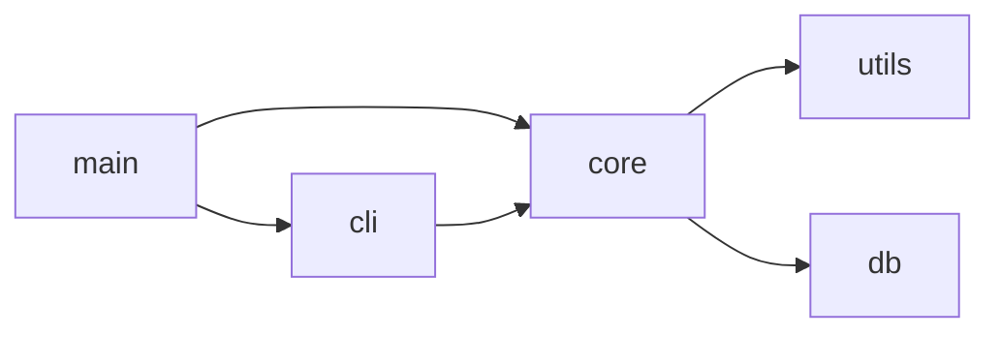

# Project to Skill

## Purpose

读取工作目录下的项目代码，深入理解其组成结构、运行原理、数据流方向和工作步骤，然后自动将其转化为一个可复用的 Claude Code Skill。如果项目不适合转化为 Skill（如纯文档仓库、高度硬件依赖、或被判定为不适合 AI 自动化执行），则明确告知用户原因并终止转换。

本 Skill 填补了从"代码分析"到"Skill 生成"之间的鸿沟：
- `codebase-analyzer` 负责深度分析并生成报告，但不创建 Skill
- `deepwiki-ai-agent` 负责生成 Wiki 文档，也不创建 Skill
- **本 Skill 直接输出可注册使用的 `SKILL.md` + `README.md`**

## When to Use

- 用户有一个功能明确的工具/脚本/项目，希望将其能力封装为可复用的 Claude Code Skill
- 用户编写了一个数据处理的 Python 脚本，希望 Claude 能按脚本的逻辑自动处理数据
- 用户有一个内部工具库，希望团队成员能通过 Claude Skill 方便地调用其核心功能
- 用户分析了一个第三方开源项目，想将其核心工作流转化为 Skill
- 用户希望将重复性的人工操作流程（当前由脚本/工具辅助完成）自动化
- 用户需要对已有项目进行"Skill 化改造"，使其工作流可被 AI 理解和执行

## When NOT to Use

- 项目是纯 UI/视觉项目（游戏、设计工具、动画软件）—— 其核心价值在视觉输出，AI 无法复制
- 项目高度依赖特定硬件环境（如 Arduino、GPIO、专用外设）—— AI 无法操作物理设备
- 项目是纯文档仓库或配置文件集合（如 dotfiles）—— 没有可执行的"功能逻辑"
- 项目本身就是 Claude Code Skill（已经是一个 Skill，无需转换）
- 项目过于简单（仅 1-2 个配置文件，无实质功能逻辑）—— 不值得封装为 Skill
- 用户只是想了解项目如何运行，并非要创建 Skill —— 应使用 codebase-analyzer
- 用户需要生成 Wiki 文档而非 Skill —— 应使用 deepwiki-ai-agent

## Workflow

> 本 Skill 在 `context: fork` 的隔离 Agent 中运行。执行流程分为五个阶段共 12 个步骤。

---

### 阶段一：项目发现与适用性评估

#### Step 1: 解析目标项目路径

解析 `$ARGUMENTS` 确定要分析并转换的项目：

- 如果包含路径参数（如 `project-to-skill ../my-tool` 或 `project-to-skill /absolute/path`），将指定路径作为 `PROJECT_ROOT`
- 如果无参数，将当前工作目录（`pwd` 或 `PWD`）作为 `PROJECT_ROOT`
- 记录 `PROJECT_ROOT`、`PROJECT_NAME`（目录名）和 `TIMESTAMP`（格式 `YYYY-MM-DD_HHmmss`）
- 验证 `PROJECT_ROOT` 存在且可读，不存在则提示用户

#### Step 2: 快速项目画像

在 30 秒内完成以下扫描，建立项目的第一印象：

**2a. 扫描顶级目录结构：**
```bash
ls -la "$PROJECT_ROOT" | head -80
```

**2b. 识别构建/配置文件：**

| 技术栈 | 标志性文件 |
|--------|-----------|
| Node.js/TypeScript | `package.json`, `tsconfig.json`, `yarn.lock` |
| Python | `requirements.txt`, `pyproject.toml`, `setup.py` |
| Rust | `Cargo.toml`, `Cargo.lock` |
| Go | `go.mod`, `go.sum` |
| Java/Kotlin | `pom.xml`, `build.gradle` |
| Shell | `*.sh`, `*.bash` |
| PowerShell | `*.ps1` |
| Docker | `Dockerfile`, `docker-compose.yml` |
| CI/CD | `.github/workflows/`, `.gitlab-ci.yml` |
| Make | `Makefile`, `justfile` |

读取关键配置文件头部区域（如 `package.json` 的 `dependencies`/`scripts`、`Cargo.toml` 的 `dependencies`）。

**2c. 统计代码规模：**
```
Glob  PROJECT_ROOT/**/*.{js,ts,py,rs,go,java,sh,ps1,rb,php,c,cpp,h,hpp,swift,kt,kts,cs,lua,pl,pm}
```
- 统计各语言的文件数和估算代码行数
- 记录文件总数：`FILE_COUNT`
- 如果 `FILE_COUNT > 1000`，标记为"大型项目"，后续采用采样分析

**2d. 扫描 Git 元数据：**
```
Bash cd "$PROJECT_ROOT" && git log --oneline -20
```
- 获取近期提交信息，理解项目活跃度
- 如果不存在 `.git`，注明"未发现 Git 仓库"

**2e. 输出项目快照卡片：**
```markdown
## 项目快照
- **项目名称**：{PROJECT_NAME}
- **技术栈**：[从配置文件推断]
- **代码规模**：X 个文件
- **语言分布**：[按文件数排序]
- **核心功能推测**：[从目录结构和入口文件初步判断]
```

#### Step 3: 适用性评估（核心决策点）

从 6 个维度系统评估项目是否适合转化为 Skill，**任一核心维度不通过则终止并告知用户**：

| 维度 | 问题 | 评估方法 | ⚠️ 不通过的标志 |
|------|------|---------|----------------|
| **功能完整性** | 项目是否包含可执行的逻辑？ | 检查 `src/`、`lib/`、`bin/`、`main.*`、`index.*` 等是否有实质代码 | 仅含配置文件、文档、样式文件、图片 |
| **环境独立性** | 核心功能是否能在 AI 环境中运行？ | 分析是否需要特定硬件、操作系统、网络环境 | 需要 Arduino/GPIO/专用外设、特定物理设备 |
| **AI 可执行性** | 功能能否被转化为 Claude 指令？ | 判断核心任务是否可用 Read/Write/Grep/WebSearch 等工具完成 | 需要复杂 GUI 操作、需要实时视频/音频处理、需要物理交互 |
| **输入输出明确性** | 功能是否有清晰的输入和输出？ | 分析 CLI 参数、函数签名、文件格式 | "输入"和"输出"完全模糊，无法定义边界 |
| **封装价值** | 封装为 Skill 是否比直接运行脚本更有效？ | 判断是否适合渐进式加载、是否需要 AI 的推理能力 | 项目太简单（< 50 行）、或纯属个人配置 |
| **规模可控性** | 核心功能是否能在上下文窗口内表达？ | 评估核心逻辑的复杂度 | 核心代码超过数千行且无法简化 |

**决策规则：**

1. **立即终止**（任一条件命中）：
   - `功能完整性`不通过 → 输出："❌ 项目不包含可执行的代码逻辑，不适合转化为 Skill。仅含 [列出内容类型]。"
   - `环境独立性`不通过 → 输出："❌ 项目核心功能依赖特定硬件/环境 [列出具体依赖]，AI 无法操作物理设备。"
   - `AI 可执行性`不通过 → 输出："❌ 项目核心功能 [如：需要 GUI 交互] 无法通过 Claude 内置工具实现。"

2. **警告但可继续**（以下条件命中时，输出警告后询问用户是否继续）：
   - `输入输出明确性`不通过 → "⚠️ 项目的输入输出边界不清晰，生成的 Skill 可能无法准确覆盖所有使用场景。是否继续？"
   - `封装价值`不通过 → "⚠️ 该项目较为简单（仅 X 行有效代码），直接运行可能比封装为 Skill 更高效。是否继续？"
   - `规模可控性`不通过 → "⚠️ 核心逻辑较为复杂（约 X 行），生成的 Skill 可能无法完整覆盖所有功能。建议定位到子模块。是否继续？"

3. **全部通过** → 继续执行 Step 4

**评估输出格式：**
```markdown
## 适用性评估结果
- ✅ 功能完整性：{通过/不通过}
- ✅ 环境独立性：{通过/警告/不通过}
- ✅ AI 可执行性：{通过/不通过}
- ✅ 输入输出明确性：{通过/警告}
- ✅ 封装价值：{通过/警告}
- ✅ 规模可控性：{通过/警告}

**结论**：{适合转换 / 不适合转换（原因） / 需用户确认后继续}
```

---

### 阶段二：深度理解

#### Step 4: 架构与结构分析

**4a. 构建目录结构全景：**

使用 `Glob` 获取完整目录树（排除 `node_modules`、`.git`、`target`、`dist`、`build`、`__pycache__`、`.next`、`venv`、`.venv`）：

```
PROJECT_NAME/
├── src/              # 源代码
│   ├── main.ts       # 入口文件
│   ├── cli.ts        # CLI 参数解析
│   └── core/         # 核心逻辑
├── config/           # 配置文件
├── tests/            # 测试文件
├── scripts/          # 辅助脚本
└── docs/             # 文档
```

**4b. 识别入口文件与初始化链路：**

查找项目入口文件并读取其核心启动逻辑：

| 技术栈 | 入口文件搜索顺序 |
|--------|----------------|
| Node.js | `src/index.ts`, `src/app.ts`, `src/main.ts`, `index.js`, `bin/` 中指定的入口, `package.json#bin/main` |
| Python | `main.py`, `app.py`, `cli.py`, `__main__.py`, `entry_point` from `setup.py`/`pyproject.toml` |
| Rust | `src/main.rs`, `src/lib.rs` |
| Go | `main.go`, `cmd/*/main.go` |
| Shell | 项目根目录或 `bin/` 下的 `*.sh` 文件 |
| 通用 | `README.md` 中的"Usage"或"Quick Start"章节 |

读取入口文件后记录：
- 参数解析方式（`argparse`、`commander`、`clap`、`flags` 等）
- 主函数/主流程的执行序列
- 配置文件的加载方式

**4c. 核心模块识别：**

使用 `Grep` 扫描以下模式识别核心模块及其功能：

| 搜索目标 | 模式 |
|---------|------|
| 函数定义 | `def `, `function `, `fn `, `=> `, `(.*) {` |
| 类定义 | `class `, `struct `, `interface `, `trait ` |
| 导出/公开接口 | `export `, `pub `, `module.exports`, `__all__` |
| 路由/命令 | `app\.(get|post|put|delete)`, `.command(`, `@app\.`, `router\.` |
| 子命令 | `.subcommand`, `add_subparser`, `Command(` |

对每个识别到的核心模块，读取其文件头部（前 50 行）和关键函数定义，理解模块职责。

**4d. 模块依赖关系分析：**

搜索 import/require/use 语句构建模块间的依赖关系图：

- 记录每个模块导入了哪些内部模块（排除标准库和第三方包）
- 识别"高度内聚"的模块组（互相依赖的模块集群）
- 识别"入口模块"（被依赖最多的模块）
- 输出简化的 Mermaid 依赖图：



#### Step 5: 工作流与数据流分析

**5a. 核心工作流提取（含循环/重试/错误恢复检测）：**

从入口文件开始，沿主执行路径提取项目的核心工作流。**对于包含循环、重试、错误恢复的代码，必须逐字记录过程细节，不得跳过或抽象。**

1. 读取主流程代码，**每遇到一个条件分支（if/else/switch/match），记录为决策节点**，必须包括分支条件和两个方向的处理
2. **循环检测**：每遇到一个循环结构（for/while/loop/map/retry/backoff），**必须记录以下全部信息**：
   - 循环类型（for/while/loop/map + sleep/retry）
   - 循环次数（固定次数如 `for i in range(10)` 或条件如 `while retry_count < 10`）
   - 循环体的核心操作（每次循环执行什么）
   - 循环终止条件（正常完成 / 全部成功 / 超出最大重试次数）
   - 循环内的错误处理（continue/break/retry/raise 分别对应什么）
   - 退避/等待策略（如有 sleep/backoff，记录延迟时间和增长方式）
3. **重试/退避检测**：搜索以下模式判断项目是否包含重试逻辑：
   | 模式 | 含义 | 必须记录的信息 |
   |------|------|--------------|
   | `time.sleep(n)`, `sleep(n)`, `await delay(n)` | 固定延迟后重试 | 延迟秒数 `n` |
   | `retry_count += 1`, `attempts++` | 手动计数重试 | 最大重试次数、计数变量名 |
   | `exponential_backoff()`, `backoff` 库 | 指数退避重试 | 初始延迟、最大延迟、倍率 |
   | `@retry`, `@backoff`, `@retryable` | 装饰器式重试 | 参数（次数、延迟、重试条件） |
   | `for i in range(max_retries)` | 固定次数循环重试 | `max_retries` 的值 |
   | `while True: ... break if success` | 无限循环直到成功 | 退出条件、最大尝试次数限制 |
4. **错误恢复路径**：每个循环/重试结构必须记录错误发生时的恢复路径：
   - 单次失败后：continue（跳过继续）/ break（终止循环）/ retry（重新尝试当前项）/ raise（抛给上层）
   - 全部失败后：返回默认值 / 抛出最终错误 / 记录失败列表继续执行
5. 每遇到一个函数调用，**如果是循环/重试/错误处理相关的函数，视为关键处理步骤，必须深入读取；如果是纯工具函数（字符串格式化、日志记录），可跳过**
6. 记录步骤描述、对应的代码位置、循环变量名和范围

```markdown
### 提取的工作流示例（带循环/重试）

工作流（从 src/uploader.ts:10 至 src/uploader.ts:100）：

├── [1] 解析命令行参数 (cli.ts:15)
├── [2] 读取上传文件列表 (reader.ts:22)
├── [3] 逐文件上传（循环体）(uploader.ts:45-80)
│   ├── 循环类型：for file_path in file_list
│   ├── 循环次数：file_list 的长度（用户提供，无上限）
│   ├── 单次上传内容：
│   │   ├── 3a. 读取文件内容 (reader.ts:30)
│   │   ├── 3b. POST 到 /api/upload (uploader.ts:50)
│   │   └── 3c. 记录响应结果 (uploader.ts:55)
│   ├── 重试逻辑：
│   │   ├── 失败后等待 2 秒 (sleep.ts:5)
│   │   ├── 最多重试 3 次 (uploader.ts:48)
│   │   └── 3 次均失败 → 跳过该文件，记录到 failed_files 列表
│   └── 循环终止：全部 file_list 处理完毕
├── [4] 输出上传结果摘要 (reporter.ts:15)
│   ├── 条件：failed_files 不为空 → 输出失败文件列表和错误原因
│   └── 条件：全部成功 → 输出 "All files uploaded successfully"
└── [5] 程序退出
```

**5b. 数据流追踪：**

选取 1-2 个核心功能路径，完整追踪数据从输入到输出的变换过程：

追踪每个步骤中数据的格式变化：
```
输入 (原始格式)
  → Step 1: 解析 (ParserOutput 类型)
  → Step 2: 验证 (ValidatedData 类型)
  → Step 3: 处理 (ProcessedResult 类型)
  → 输出 (最终格式)
```

记录每条数据路径涉及的关键函数签名：
```
函数: transformData(input: RawData) -> ProcessedData
位置: src/core/processor.ts:45
输入格式: { items: Item[], options: Options }
处理逻辑: [2-3 句简述做了什么]
输出格式: { results: Result[], summary: Summary }
```

**5c. 错误处理链路分析：**

搜索项目中所有的错误处理模式：
- try-catch 块
- Result/Option 类型
- 错误码返回
- 全局异常处理器

记录每种错误的触发条件和处理方式：
```markdown
| 错误场景 | 触发条件 | 处理方式 | 代码位置 |
|---------|---------|---------|---------|
| 文件不存在 | 输入路径无效 | 抛 FileNotFoundError | processor.ts:22 |
| 格式无效 | 数据格式不符合规范 | 返回 ValidationError | validator.ts:35 |
```

#### Step 6: 精度保留的语义提取（核心精度控制点）

> **⚠️ 这是整个 Skill 生成流程中最关键的精度控制节点。** 本步骤决定了生成的 Skill 是"精确再现"还是"过度简化"。每一次提取都必须在"保留精度"和"抽象概括"之间取得平衡——**宁可保留过多细节，也不可过度简化**。

将代码逻辑从"实现细节"抽象为"语义步骤"—— 这是从代码到 Skill 的关键转化步骤。但**抽象不等于简化**，必须遵循以下精度保留规则：

**精度保留铁律：**
1. **参数信息不得丢失**：代码中的每个参数名、默认值、取值范围、校验规则必须保留在 Skill 步骤中
2. **条件分支必须完整**：每个 if/else/switch/match 分支必须对应 Skill 中一个可区分的处理路径
3. **错误场景必须一对一转译**：代码中的每个 try-catch/Result/Error 类型必须对应 Skill 中一个明确的异常处理描述
4. **数据格式变化必须面面俱到**：代码中每个步骤的数据类型变化（如 str → Dict → Model → JSON）必须在 Skill 步骤中明确标注
5. **禁止使用模糊动词**：禁止出现"处理数据""执行逻辑""分析输入""管理资源"等无信息量的动词

#### 6a. 精度保留的降维提取

对于每个核心模块，提取其本质功能时**必须同时记录以下三个层级的信息**：

| 层级 | 必须记录的内容 | 禁止的行为 |
|------|--------------|-----------|
| **L1 — 功能摘要** | 一句话描述该模块做什么（控制粒度） | 禁止用此摘要替代完整流程 |
| **L2 — 步骤与参数** | 完整的步骤序列，每个步骤包含输入参数名/类型/默认值、输出格式、处理逻辑、边界条件 | 禁止省略参数名、类型、默认值和取值范围 |
| **L3 — 异常路径** | 每个步骤可能失败的全部场景、触发条件、失败处理方式 | 禁止遗漏任何 try-catch/Result 分支 |

**示例（正确做法 — 保留 L1+L2+L3）：**
```markdown
## 模块：CSV 处理器 (src/processor.py)

### L1 — 功能摘要
读取 CSV 文件，按用户指定的列进行聚合统计，输出为 JSON 格式。

### L2 — 步骤与参数
| # | 步骤 | 输入 | 输出 | 逻辑要点 | 位置 |
|---|------|------|------|---------|------|
| 1 | 解析命令行参数 | sys.argv → input_path(必填str), output_col(可选str, 默认"value"), agg_func(可选str, 默认"sum", 可选值:sum/avg/count/min/max), group_col(可选str, 默认"category") | Namespace 对象 | 使用 argparse, 非法的 agg_func 值直接报错退出 | cli.py:20-45 |
| 2 | 读取 CSV 文件 | input_path(str) → 文件存在性检查 → csv.DictReader | list[dict] | UTF-8 编码；文件不存在抛出 FileNotFoundError；空文件返回空列表 | reader.py:10-35 |
| 3 | 按列分组聚合 | data(list[dict]), group_col(str), agg_col(str), agg_func(str) → DataFrame.groupby → agg | dict{group: value} | group_col 不在列名中→抛出 KeyError 含可用列名列表；空 data 返回 {} | aggregator.py:20-55 |
| 4 | 输出 JSON 文件 | result(dict), output_path(str) → json.dumps(indent=2) → 写入文件 | 文件写入 | 使用 Write 工具；输出路径不存在则创建父目录 | output.py:10-25 |

### L3 — 异常路径
| 步骤 | 错误场景 | 触发条件 | 处理方式 | 位置 |
|------|---------|---------|---------|------|
| 1 | 缺少必填参数 | input_path 未提供 | argparse 自动打印 usage 并退出 | cli.py:22 |
| 1 | 无效聚合函数 | agg_func 不是 sum/avg/count/min/max | 打印 "无效聚合函数: X，可选值: sum/avg/count/min/max" 并退出 | cli.py:30 |
| 2 | 文件不存在 | input_path 路径无文件 | 打印 "文件未找到: X" 并退出 | reader.py:12 |
| 3 | 分组列不存在 | group_col 不是 CSV 列名 | 打印 "列 X 不存在，可用列: [A,B,C]" 并退出 | aggregator.py:25 |
```

**错误做法 — 过度简化（遗漏参数名、类型、边界条件）：**
```markdown
## 模块：CSV 处理器
读取 CSV 文件，按聚合统计，输出 JSON。
1. 解析参数
2. 读取文件
3. 聚合计算
4. 输出结果
```

**6b. 功能-工具映射：**

将代码中的每个操作映射到 Claude 可用的工具：

| 代码操作 | Skill 等价指令 | Claude 工具 |
|---------|---------------|------------|
| 读取文件 | 使用 Read 读取用户提供的文件 | `Read` |
| 解析 CSV | 读取 CSV 内容并分析 | `Read` + 文本分析 |
| API 调用 | 使用 WebFetch 获取数据 | `WebFetch` |
| 数据转换 | 使用指令描述转换逻辑 | 内置推理能力 |
| 写入结果 | 将结果写入文件 | `Write` |
| 搜索信息 | 使用 WebSearch 查找资料 | `WebSearch` |
| 批量处理 | 使用 Glob 定位文件后逐个处理 | `Glob` + `Read` |
| 命令执行 | 执行 shell 命令 | `Bash` |

**6c. 外部依赖识别：**

识别项目依赖的外部服务和 API，评估 Claude 能否替代：
- **可替代**：文件操作、文本处理、数据格式转换、代码分析、模式匹配
- **需保留**：特定第三方 API（GitHub API、Slack API、云服务 API）
- **不可用**：需要特定物理设备、需要 GPU 训练、需要实时音视频

对需保留的外部 API，在生成的 Skill 中标注 API 认证方式和用法说明。

**6d. 参数与边界提取（确保精度不丢失）：**

对核心函数/入口函数的参数列表执行"逐参数映射"——每个参数必须在生成的 Skill 中有对应的输入项：

```markdown
## 参数映射表：src/main.py:parse_args()

| 参数名 | 类型 | 是否必填 | 默认值 | 取值范围/校验 | Skill 中的对应输入描述 |
|--------|------|---------|--------|-------------|---------------------|
| input_path | str | ✅ 是 | 无 | 路径必须存在 | "用户提供输入文件路径（必填），如文件不存在则报错终止" |
| output_format | str | ❌ 否 | "json" | "json"/"csv"/"yaml" | "输出格式（可选，默认 json，可选值: json/csv/yaml）" |
| verbose | bool | ❌ 否 | False | true/false | "是否输出详细日志（可选，默认 false）" |
| max_items | int | ❌ 否 | 1000 | 正整数，≥1 | "最大处理条数（可选，默认 1000，必须 ≥1）" |
```

**规则：**
- 每个 CLI 参数、函数参数、配置项都必须逐条映射
- 参数的可选值必须显式列出（而非"固定的几个值"这种模糊描述）
- 参数的默认值必须记录
- 参数之间的依赖关系必须标注（如"当 format=csv 时必须提供 delimiter 参数"）
- 不允许出现"用户提供必要的参数"这类无信息量的写法

**6e. 步骤颗粒度校准（防止过度合并）：**

用以下 3 个判断准则检查每一步的大小是否合适：

**准则 1 — 单一职责测试**：如果一个步骤包含了两个以上不同性质的操作（如"读取文件并发送邮件"），拆分为两个步骤。

**准则 2 — 信息密度测试**：每个步骤的指令描述不得少于 30 个字符（纯功能描述），必须包含输入、处理、输出要素。少于 30 个字符的步骤判定为"过度简化"，必须合并上下文或补充细节。

**准则 3 — 条件边界测试**：Review each generated step and ask: "如果输入异常（为空/格式错误/超出范围），这个步骤是否有明确的处理行为？"如果答案为否，必须补充异常处理。

**颗粒度校准流程：**
```
Step 6a 提取的语义步骤列表
  → 对每个步骤执行 "单一职责测试"
  → 如果步骤太粗 → 拆分为更细的步骤
  → 对每个步骤执行 "信息密度测试"  
  → 如果步骤描述 <30 字 → 补充输入/输出/边界细节
  → 对每个步骤执行 "条件边界测试"
  → 如果缺少异常处理 → 补充异常路径
  → 输出校准后的步骤列表
```

**6f. 过程式忠实保证（v2.1.0 新增 — 应对不确定性的安全网）：**

> **核心原则：当不确定 AI 能否精准执行某一步骤时，必须严格按照项目流程的原始描述来写，不得做任何抽象简化。宁可写 500 字详细描述一个步骤，不可用 10 字概括而丢失关键细节。**

此机制是 v2.1.0 升级的核心理念，专门解决"项目中有精确的循环次数、重试策略、错误恢复路径，但生成的 Skill 丢失了这些细节"的问题。

**6f-i. 双模式决策：**

在开始步骤提取前，先判断每条代码路径应该使用哪种模式：

| 模式 | 名称 | 适用条件 | 行为 |
|------|------|---------|------|
| **模式 A** | 语义抽象模式 | 代码是简单的线性数据转换（如 CSV→JSON），无循环、无重试、无复杂错误恢复 | 可以使用"抽象提取"，将步骤合并为合理的语义单元 |
| **模式 B** | 过程式忠实模式 **（默认）** | **代码包含循环、重试、递归、错误恢复、状态机中的任意一种** | **严格按项目流程逐步骤记录**，完整保留循环次数、重试策略、延迟时间、错误恢复路径、状态转换条件 |

**决策规则：**
1. 先检查 Step 5a 的循环/重试检测结果
2. 如果检测到任何循环/重试/递归模式 → **强制使用模式 B**
3. 如果没有检测到 → 优先使用模式 B（保守），仅在代码明确是简单线性数据处理时才使用模式 A
4. **不确定时始终选择模式 B**（宁详细毋简略）

**6f-ii. 过程式记录规范（模式 B 专用）：**

使用模式 B 时，每个 Workflow 步骤必须额外记录以下信息：

| 代码模式 | 必须记录的内容 | 示例（正确） | 示例（错误—过于简化） |
|---------|--------------|------------|-------------------|
| **固定次数循环** | 循环变量名、起始值、结束值、步长、循环体执行的操作 | `for i in range(max_retries):` 其中 max_retries=10，每次循环体执行 upload()，成功后 break | "批量处理" |
| **条件循环** | 条件表达式、每次循环体的变化、终止条件 | `while retry_count < max_retries and not success:`，每轮 retry_count+=1，成功后 success=True | "循环直到成功" |
| **固定延迟重试** | 延迟秒数、是否在延迟前后有额外操作 | `time.sleep(2)` 每次重试前等待 2 秒 | "等待一段时间" |
| **指数退避** | 初始延迟、最大延迟、倍率、抖动 | `delay = min(2^n, 60)` 初始 2s，最大 60s，n 为重试次数 | "逐渐增加等待时间" |
| **错误计数** | 错误计数器变量名、触发阈值后的行为 | `error_count` 初始 0，每次失败 +1，≥10 时停止服务并告警 | "检测错误次数" |
| **断路/熔断** | 阈值、半开状态恢复时间、状态迁移 | 连续 5 次失败 → 打开断路器，30 秒后尝试半开，成功则关闭 | "熔断保护" |
| **超时控制** | 超时值、超时后的行为 | `timeout=30` 秒超时，超时后抛出 TimeoutError，由上层重试机制捕获 | "设置超时" |

**6f-iii. 不确定性降级规则：**

当对以下问题中的任意一个回答"不确定"或"可能"时，**必须降级到最详细的写法**：

| 问题 | 不确定时的处理 |
|------|-------------|
| "这个循环究竟循环多少次？" | 写出完整表达式 `for attempt in range(1, max_retries+1)` 而非"循环多次" |
| "重试之间的等待时间是多少？" | 写出精确值 `time.sleep(2)` 或 `min(2^n, 60s)` 而非"等一会儿" |
| "出错后怎么恢复？" | 写出完整恢复路径 `except TimeoutError → retry_count += 1; if retry_count >= 10: raise` 而非"重试或报错" |
| "循环退出后数据状态是什么？" | 写出退出后的状态 `failed_files` 列表、`success_count` 计数器、`has_error` 标志位 |

**降级铁律：**
```
不确定 + 循环次数 → 写出完整循环边界（起始/结束/步长）
不确定 + 重试策略 → 写出完整退避公式（初始值/倍率/最大值）
不确定 + 错误恢复 → 写出完整异常处理链（异常类型/处理动作/传播路径）
不确定 + 状态转换 → 写出完整状态机（当前状态/事件/下一状态/条件）
```

### 阶段三：Skill 蓝图设计

#### Step 7: 设计 Skill 元数据

**7a. 确定 Skill 名称：**

将项目名称转换为 kebab-case 作为 Skill 名称：
- `DataProcessor` → `data-processor`
- `my_analysis_tool` → `my-analysis-tool`
- `图片压缩工具` → `image-compressor`

如果项目名本身已经是 kebab-case 且符合规范，直接使用。

**7b. 设计触发关键词：**

基于项目的核心功能，设计中文和英文的触发关键词：
- 从 README 和入口文件描述中提取用户可能使用的自然语言短语
- 每个功能点至少对应 2 个触发短语（1 中 + 1 英）
- 遵循"略微激进"原则——宁可误触发也不要漏触发

**7c. 确定所需工具权限：**

根据 Step 6b 的功能-工具映射，确定 `allowed-tools`：

| 项目特征 | 必备工具 | 可选工具 |
|---------|---------|---------|
| 文件处理 | `Read Write Glob` | `Edit` |
| API 集成 | `WebFetch WebSearch` | `Bash` |
| 代码分析 | `Read Grep Glob` | `Write` |
| 数据处理 | `Read Write Bash` | `Glob` |
| 自动化脚本 | `Bash Read Write` | `Glob` |
| 通用 | `Read Write Bash` | 按需添加 |

**7d. 设计 Workflow 步骤（精度门控）：**

将 Step 5a 提取的工作流、Step 6a 的语义步骤、Step 6d 的参数映射表和 Step 6e 校准后的颗粒度，重新组织为 Skill 的 Workflow 步骤。**每个步骤必须强制包含"输入-处理-输出-异常-步骤衔接"五要素：**

**7d-i. 五要素格式要求：**

```markdown
### Step N: <步骤名称>

**输入**：<列出本步骤需要的输入参数/数据/文件，标注类型、格式、来源（来自上一步还是用户提供）>

**处理过程**：<用具体的动词描述本步骤执行的操作，必须包含条件分支的处理方式>

**输出**：<列出本步骤产生的输出，标注递交给下一步还是返回给用户>

**异常处理**：<输入无效时怎么办、处理失败时怎么办、部分成功时怎么办>

**步骤衔接**：<本步骤完成后，下一步是什么？是否有条件跳转？>
```

**禁止行为：**
- ❌ 步骤名称中使用"处理""执行""管理"等无信息量的动词
- ✅ 步骤名称使用"解析CSV""过滤空值行""按列聚合""发送通知邮件"等具体描述
- ❌ 步骤描述中使用"数据""结果""文件"等无指代的宽泛名词
- ✅ 步骤描述中使用"输入的 CSV 行记录""聚合后的 dict{group: value}""输出的 JSON 文件"等具体指代

**7d-ii. 步骤分解精度矩阵：**

将 Step 5a 提取的工作流和 Step 6a 的语义步骤，按以下精度矩阵进行转换：

| 项目中的代码模式 | Skill 步骤生成规则 | 精度底线 |
|-----------------|-------------------|---------|
| **顺序调用链**（A→B→C） | 每个函数调用对应 1 个 Skill 步骤，除非 2 个相邻函数属于同一逻辑单元（如 validate+sanitize） | 最多每 2 个函数调用合并为 1 个步骤，合并时要在步骤描述中说明两个子操作 |
| **条件分支**（if/else/switch/match） | 步骤中必须显式写出分支条件：`if X: do A / else: do B` | 分支条件必须完整描述，不能省略 else 分支 |
| **循环**（for/while/map/sleep/retry/backoff） | **步骤中必须使用"过程式忠实描述"**：写明循环类型、循环次数/条件、每次循环执行的操作、循环内的错误处理、循环后的状态变化、退避/延迟策略。**不得使用"对每一条输入执行相同操作"这种抽象概括** | 循环次数必须精确（如 `range(10)` 不可写成"多次"），退避策略必须写出公式（如 `min(2^n, 60)` 不可写成"逐渐增加"），错误恢复路径必须完整 |
| **重试/退避**（@retry/while+retry/exponential_backoff） | **步骤必须完整记录**：重试条件（哪些异常触发重试）、最大重试次数（精确数值）、延迟策略（固定/指数/线性）、退避公式参数（初始延迟/倍率/最大延迟）、退出条件（成功/达到最大次数/不可恢复错误） | 不能简化成"失败后重试"——必须写明"最多重试 10 次，每次间隔 2 秒，全部失败后跳过该条目并记录到 error_list" |
| **错误捕获**（try/except/Result/Option） | 错误场景必须在步骤的 "异常处理" 部分描述 | 每个 try/except 都必须对应一个异常处理描述 |
| **配置读取**（config/args/env） | 每个配置项展开为 Skill 输入参数，标注类型和默认值 | 不得合并为"读取配置"一句话带过 |
| **外部 API 调用**（HTTP/gRPC/SDK） | 步骤中说明使用 `WebFetch`/`Bash`/`WebSearch` 调用，并附上 API 文档来源 | 必须说明认证方式（如 GH_TOKEN 环境变量） |

**7d-iii. 示例：高精度 vs 低精度步骤转换：**

**低精度（当前的问题 — 过于简化）：**
```markdown
### Step 3: 执行核心处理
使用提供的数据进行处理，输出结果。
# ❌ 问题：没说怎么处理、处理什么、处理条件是什么、出错怎么办
```

**高精度（目标 — 完整保留代码信息）：**
```markdown
### Step 3: 按分组列聚合数据

**输入**：来自 Step 2 的 `data: list[dict]`（CSV 的行记录列表），用户指定的 `group_col: str`（默认 "category"）、`agg_col: str`（默认 "value"）、`agg_func: str`（可选值: sum/avg/count/min/max，默认 "sum"）

**处理过程**：
1. 根据 `group_col` 对 data 进行分组
2. 对每个分组，对 `agg_col` 列应用 `agg_func` 聚合函数
3. 特殊情况处理：
   - 如果 `data` 为空列表 → 直接返回 `{}`
   - 如果 `group_col` 不是 data 中的列名 → 报错终止，列出可用列名
   - 如果 `agg_col` 的某行值为 None → 该行计入总数但不参与数值聚合（等价于 pandas 的 skipna=True）

**输出**：`aggregated: dict[str, float]` → 每个分组的聚合值，传递至 Step 4（JSON 输出）

**异常处理**：
- 无效 `agg_func`：用户提供的聚合函数名不在可选值中 → 报错"无效聚合函数，可选值: sum/avg/count/min/max"
- 列名不存在：`group_col` 或 `agg_col` 在 data 的列名中找不到 → 报错"列 X 不存在，可用列: [A, B, C]"
- 数据类型错误：`agg_col` 的列值无法转换为数值类型 → 标记该行并跳过，在输出报告中注明

**步骤衔接**：Step 3 输出传递给 Step 4（输出 JSON）。如果 Step 3 执行失败（不可恢复的错误），终止流程并输出错误信息。
```

**7d-iv. 步骤衔接约束：**

生成的 Workflow 步骤之间必须满足以下约束，确保无断裂：
1. **输入来源检查**：Step N 的输入要么来自用户（标注"用户提供"），要么是 Step N-1 的输出（标注递接关系）
2. **输出去向检查**：Step N 的输出要么用于 Step N+1（标注用途），要么是最终结果（标注"最终输出"）
3. **条件跳转标注**：如果某一步的条件分支导致跳过后续某些步骤（如"如果文件为空则直接输出空结果，不执行后续分析"），必须显式标注

**7e. 设计 Constraints：**

从项目的约束条件推导 Skill 的 Constraints：
- 代码中的硬编码限制 → Skill 的 Always/Never 规则
- 项目 README 中的注意事项 → Skill 的 Notes 或 Constraints
- 错误处理策略 → Skill 的异常处理逻辑

---

### 阶段四：Skill 生成

#### Step 8: 生成 SKILL.md

创建 `<skill-name>/` 目录并生成 `SKILL.md`：

```
Bash mkdir -p "$PROJECT_ROOT/<skill-name>"
```

输出路径：
```
PROJECT_ROOT/
└── <skill-name>/
    ├── SKILL.md
    └── README.md
```

**SKILL.md 必须包含以下完整内容：**

**Frontmatter**（YAML）：

```yaml
---
name: <skill-name>                    # Step 7a 确定
description: >-                       # Step 7b 设计
  <核心功能描述>。Triggered by: "<触发词1>", "<触发词2>", ...
version: 1.0.0
allowed-tools: <Step 7c 确定的工具列表>
metadata:
  tags: <分类标签>
---
```

**正文结构：**

```markdown
# <Skill 名称>

## Purpose
一句话描述 Skill 的功能。格式：将 [项目名] 的 [核心功能] 封装为可复用的 Claude Code Skill。

## When to Use
- <场景 1>
- <场景 2>
- ...

## When NOT to Use
- <排除场景 1>
- <排除场景 2>
- ...

## Workflow / Steps
### Step 1: <步骤名称>
<具体指令>

### Step 2: <步骤名称>
<具体指令>

...（按 Step 7d 设计的步骤编写）

## Constraints
- Always <规则>
- Never <规则>

## Examples
### ✅ Do This
```
输入示例 → 期望输出
```
### ❌ Not This
```
输入示例 → 错误做法
```

## Notes
- 边界情况和已知限制
- 依赖说明（Step 6c 识别的外部依赖）
```

**生成规则（精度强制）：**

1. **五要素格式**（必须遵守）：每个 Workflow 步骤必须包含 `**输入**`、`**处理过程**`、`**输出**`、`**异常处理**`、`**步骤衔接**` 五个部分，格式如 Step 7d-i 定义
2. **动词强制列表**：禁止使用的动词列表（无信息量）：
   - ❌ 禁止：处理、执行、管理、分析、操作、开展、进行、实现
   - ✅ 必须使用：解析、读取、提取、过滤、转换、聚合、验证、格式化、写入、发送、比较、筛选、排序、创建
3. **名词强制列表**：禁止使用无指代的名词，必须使用具体类型名：
   - ❌ "数据" → ✅ "CSV 行列表 `list[dict]`" 或 "聚合结果 `dict[str, float]`"
   - ❌ "文件" → ✅ "输入 JSON 文件 `/path/to/input.json`"
   - ❌ "结果" → ✅ "处理报告 `Report` 包含 `total_rows`, `error_count`, `output_path`"
4. **信息密度检查**：生成后立即执行——每个步骤描述不得少于 60 个字符（五要素合计）；少于 60 字的步骤判定为"过度简化"，必须回退到 Step 6e 重新校准
5. **参数可追溯性检查**：Step 6d 参数映射表中的每个参数，必须在生成的步骤中有对应的输入描述。参数映射表与 Workflow 步骤之间做到"逐行可追溯"
6. **异常全覆盖检查**：Step 6a L3 异常表中的每个错误场景，必须在对应的步骤的"异常处理"中有描述。不遗漏
7. 所有指令以**动词祈使句**开头（"解析""读取""转换"），而非"你应当..."
8. 输出的文件路径以 `./<skill-name>/<分类目录>/` 开头
9. 不包含任何占位符或未完成的内容
10. **无字数限制（v2.1.0 新增）**：生成的 SKILL.md 不受字数限制。项目的每个循环、每个重试策略、每个错误恢复路径都必须完整写入，**不得因"篇幅考虑"省略任何过程式细节**。一个步骤写 500 字优于遗漏任何关键信息。宁可生成长文档，不可丢失精度
11. **过程式记录优先于语义抽象（v2.1.0 新增）**：当某段代码包含循环/重试/错误恢复时，**必须使用 Step 6f 定义的过程式忠实模式（模式 B）记录**，禁止使用语义抽象模式。如果 Step 5a 检测到任何循环或重试模式，整条代码路径全部使用模式 B

#### Step 9: 生成 README.md

在 `<skill-name>/` 下生成 `README.md`，从用户视角提供完整的使用说明：

```markdown
# <Skill 名称>

## 简介
一句话概括该 Skill 的功能和适用场景。说明其源自哪个项目。

## 目录结构
```
<skill-name>/
├── SKILL.md            # 技能主文件
└── README.md           # 本文件
```

（如果生成了 references/ 或其他目录，一并列出）

## 安装方式
1. 将 `<skill-name>/` 目录复制到 `.claude/skills/<skill-name>/` 下
2. 重新启动 Claude Code
3. 使用 `/<skill-name>` 或触发关键词激活

## 使用方式
### 斜杠命令
`/<skill-name> <参数>` — 描述作用

### 自动触发
当用户输入以下关键词时自动激活：
- <关键词 1>
- <关键词 2>

## Workflow 说明
简要描述 Skill 的执行流程（3-5 句话）。

## 技术细节
### 使用的工具
- <工具名> — 用途
- <工具名> — 用途

### 输出说明
输出文件的位置和格式。

## 注意事项
- 已知限制
- 依赖说明
- 安全注意事项
```

---

### 阶段五：验证与交付

#### Step 10: 审查生成的 SKILL.md

生成完成后，重读 SKILL.md 进行自我审查：

**逻辑审查：**
- [ ] 步骤是否完整覆盖了核心功能？从用户输入到最终输出，是否存在步骤跳跃？
- [ ] 步骤间的输入输出是否衔接？Step N 的输出是否是 Step N+1 的输入？
- [ ] 循环依赖检查：是否存在步骤 A 需要步骤 B 的输出，但步骤 B 在步骤 A 之后的情况？

**清晰度审查：**
- [ ] 是否所有的动词都是具体动词（"解析""转换""提取"），而非模糊动词（"处理""管理"）？
- [ ] 是否所有的术语都在首次出现时定义了？
- [ ] 是否存在模糊量词（"大量""多个"）被替换为具体阈值？

**安全性审查：**
- [ ] Workflow 中是否有破坏性操作（删除文件、覆盖数据）？如果有则需要添加确认步骤
- [ ] `allowed-tools` 是否按最小权限原则配置？
- [ ] 是否有无限循环或无限重试的风险？

**可行性审查：**
- [ ] 所有路径在对应步骤前确实会被创建吗？
- [ ] 引用的外部 API 或服务是否已通过验证可访问？
- [ ] 如果某一步失败，用户能否从该步重试而不从头开始？

**一致性审查（SKILL.md vs README.md）：**
- [ ] `allowed-tools` 在两处是否一致？
- [ ] Workflow 步骤描述是否矛盾？
- [ ] 目录结构描述是否匹配？
- [ ] 安装和使用方式是否一致？

发现问题 → 使用 `Edit` 工具修正，修正后重新审查。

#### Step 10b: 精度交叉验证（新增 — 质量门控）

这是防止"过度简化"和"描述不精准"的最后一道防线。生成完成后，必须在源代码和生成的 SKILL.md 之间执行"三点交叉验证"：

**验证点 1 — 参数完整性核对（对照 Step 6d 参数映射表）：**

逐条对照 Step 6d 生成的参数映射表，检查生成的 SKILL.md 的 Workflow 步骤是否包含了每个参数的处理：

```markdown
| 参数名 | 是否出现在 Workflow 中 | 出现的步骤 | 描述是否准确 | 修复动作 |
|--------|----------------------|-----------|------------|---------|
| input_path | ✅ 是 | Step 1 | ✅ 准确描述了路径校验 | — |
| output_format | ✅ 是 | Step 1 | ⚠️ 未列出可选值 (json/csv/yaml) | 补充可选值列表 |
| verbose | ❌ 否 | — | ❌ 完全缺失 | 追加到 Step 1 输入描述 |
| max_items | ✅ 是 | Step 2 | ✅ 准确 | — |
```

**发现缺失或描述不准确的参数 → 立即修复。**

**验证点 2 — 分支覆盖核对（对照 Step 5a 提取的条件分支）：**

逐条对照 Step 5a 记录的每个条件分支，检查生成的 SKILL.md 中是否有对应的处理逻辑：

| 源条件分支 | 代码位置 | 是否在 Skill 中对应 | 对应位置 |
|-----------|---------|-------------------|---------|
| `if not os.path.exists(input_path)` | reader.py:12 | ✅ "文件不存在→报错终止" | Step 1 异常处理 |
| `if agg_func not in VALID_FUNCS` | aggregator.py:25 | ❌ 缺失 | ⚠️ 需补充：无效聚合函数处理 |
| `if not data: return {}` | aggregator.py:30 | ✅ "空数据→返回{}" | Step 3 处理过程 |

**发现遗漏分支 → 立即补充到对应步骤的异常处理或条件描述中。**

**验证点 3 — 伪造/幻觉检测：**

直接对比生成的 Skill 步骤描述与源代码的实际情况：
- 检查生成的 Skill 中是否有源代码中不存在的功能描述（幻觉）
- 检查生成的 Skill 中的参数名/类型/默认值是否与源代码一致
- 检查生成的 Skill 中的错误场景是否确实在源代码中有对应的处理逻辑

**发现幻觉 → 删除并替换为准确的描述。**

**验证点 4 — 过程完整性核对（v2.1.0 新增 — 循环/重试忠实性检查）：**

直接对照 Step 5a 提取的循环/重试/错误恢复信息，和 Step 6f 的过程式记录规范，检查生成的 SKILL.md 是否符合：

| 检查项 | 源提取信息 | 生成的 SKILL.md 描述 | 判定 |
|--------|-----------|---------------------|------|
| 循环次数/条件 | `for i in range(max_retries)` 其中 max_retries=10 | "重试最多 10 次" | ✅ 准确 |
| 退避策略 | `time.sleep(2 ** attempt)` | "等待 2^attempt 秒后重试" | ✅ 准确 |
| 错误恢复 | 3 次失败后跳过，记录到 failed_files | "3 次均失败后跳过，记录到 failed_files 列表" | ✅ 准确 |
| 循环终止条件 | 所有文件处理完毕或遇到不可恢复错误 | "处理完所有文件后退出" | ⚠️ 缺少"不可恢复错误"分支 |

**发现过程式描述不完整 → 回退到 Step 6f 重新提取该部分的完整过程信息。**

**精度验证通过标准：**
- [ ] 参数完整性：参数映射表中所有参数全部在 Workflow 步骤中有对应描述，完成率 100%
- [ ] 分支覆盖：Step 5a 提取的关键条件分支 100% 在 Workflow 中有处理逻辑
- [ ] 零幻觉：Workflow 步骤中没有源代码中不存在的功能或参数
- [ ] 信息密度：每个 Workflow 步骤的"处理过程"部分描述 ≥ 60 字（含输入输出边界）
- [ ] 动词合规：每个步骤的首动词不在"禁止列表"中
- [ ] 五要素完整：每个步骤包含"输入、处理、输出、异常处理、步骤衔接"全部五要素
- [ ] 过程完整性：循环次数/重试策略/错误恢复路径与源代码一致，无抽象简化（v2.1.0 新增）

**任一标准不通过 → 回退到对应步骤修正后重新验证。**

---

#### Step 11: 向用户输出生成报告

向用户输出包含以下内容的 Markdown 报告：

```markdown
## ✅ Skill 生成完成

**名称**：`<skill-name>`
**源项目**：`<PROJECT_NAME>`（`<PROJECT_ROOT>`）
**位置**：`<PROJECT_ROOT>/<skill-name>/`

### 生成文件
- `<skill-name>/SKILL.md` — 技能主文件
- `<skill-name>/README.md` — 用户文档

### 功能概述
<2-3 句描述生成的 Skill 的功能>

### Workflow 摘要
1. <Step 1 名称>
2. <Step 2 名称>
3. <Step 3 名称>
（共 N 步）

### 安装方式
```
cp -r <PROJECT_ROOT>/<skill-name> /path/to/target-project/.claude/skills/
```
或复制到 `~/.claude/skills/` 使用户级可用。

### 源项目分析摘要
- **技术栈**：[技术栈]
- **代码规模**：X 个文件
- **核心模块**：[模块列表]
- **转换方式**：[描述如何从项目提取并转化为 Skill，展示关键对应关系]

> **注意**：生成的 Skill 提取了项目的核心工作流逻辑，但无法完全复制项目所有的边界情况和错误处理。
> 在使用过程中如发现覆盖不全的场景，可以进一步优化 SKILL.md。
```

---

## Constraints

- **Always** 在 Step 3 完成适用性评估，**任一核心维度不通过则必须终止并告知用户具体原因**
- **Always** 在开始生成前创建 `<skill-name>/` 目录，所有输出文件写入该目录
- **Always** 在 Step 6 执行"功能降维提取"——从代码实现中抽象出语义步骤，而非简单复制代码逻辑
- **Always** 生成的 SKILL.md 中所有指令以动词祈使句开头
- **Always** 在生成的 Workflow 步骤中包含异常处理（输入为空、格式错误、执行失败）
- **Always** 在生成后执行 Step 10 自我审查，使用 `Read` 重读生成的文件检查逻辑、清晰度、安全性、可行性和一致性
- **Always** 在适用性评估的"警告"分支中，使用 `AskUserQuestion` 获取用户确认后再继续
- **Always** 在引用外部 API 或第三方服务前，先使用 `WebSearch` 联网核实其当前状态和正确用法
- **Always** 将外部依赖识别结果（Step 6c）写入生成的 SKILL.md 的 Notes 或 dependencies 部分
- **Always** 执行 Step 6e（步骤颗粒度校准）的"信息密度测试"——每个步骤描述不少于 60 字，依此回退修正
- **Always** 执行 Step 7d-i 的"五要素格式要求"——每个 Workflow 步骤强制包含 输入/处理/输出/异常处理/步骤衔接
- **Always** 执行 Step 10b 的精度交叉验证，使用"参数完整性""分支覆盖""幻觉检测"三点检查
- **Always** 记录每个步骤的文件路径引用，方便用户回溯
- **Never** 修改或创建 `PROJECT_ROOT` 内除 `<skill-name>/` 之外的任何文件
- **Never** 在生成的 Skill 中包含 API 密钥、令牌、密码等敏感信息——如发现项目中含有这些信息，标记给用户
- **Never** 在生成的 SKILL.md 中留下占位符或未完成的内容
- **Always** 当 Step 5a 检测到循环/重试/错误恢复时，强制使用 Step 6f 过程式忠实模式（模式 B），完整保留循环次数、重试策略、退避算法、错误恢复路径的全部细节
- **Always** 在不确定 AI 能否精准执行某一步骤时，降级到最详细的写法（遵循 Step 6f-iii 不确定性降级规则），宁写 500 字不可遗漏任何过程细节
- **Always** 生成的 SKILL.md 不受字数限制——复杂项目必须详尽记录每个循环、每个重试、每个错误路径
- **Never** 对包含循环/重试的代码使用语义抽象——必须使用过程式忠实描述，保留循环变量名、边界值、步长、退避公式
- **Never** 移除或修改项目源代码
- 生成的 Skill 必须遵循 frontmatter 规范（name/description 必需字段、allowed-tools 语法正确）
- SKILL.md 中的输出路径统一为 `./<skill-name>/<分类目录>/` 格式
- 如果项目没有 README，用 Step 2 的快照信息补充 README.md 的"简介"部分
- 对于含多个子命令/子模块的项目，优先提取主命令/主模块的核心流程，次要功能放在 Notes 中或建议创建独立 Skill

## Examples

### ✅ Do This — 将数据处理工具转换为 Skill

**项目场景**：`f:/tools/csv-processor/`
- 技术栈：Python, pandas
- 核心功能：读取 CSV → 清洗（去空、去重）→ 按规则转换 → 输出为 JSON
- 入口文件：`csv_processor.py`（使用 argparse 解析参数）

**适用性评估**：
- ✅ 功能完整性：有完整的 CSV 处理逻辑
- ✅ 环境独立性：纯文件操作，无需特殊环境
- ✅ AI 可执行性：文件读写和数据处理完全可用 Read/Write 工具替代
- ✅ 输入输出明确性：输入 CSV 文件路径，输出 JSON 文件路径
- ✅ 封装价值：数据处理流程适合反复执行
- ✅ 规模可控性：核心逻辑约 200 行，可完整表达

**生成的核心对应关系**：
| 代码逻辑 | Skill 步骤 |
|---------|-----------|
| `argparse` 解析参数 | Step 1: 解析用户输入 — 从 `$ARGUMENTS` 获取输入路径和处理规则 |
| `read_csv()` | Step 2: 读取输入文件 — 使用 Read 读取 CSV 内容 |
| `dropna()`, `drop_duplicates()` | Step 3: 数据清洗 — 描述清洗规则，Claude 直接处理 |
| `apply(transform)` | Step 4: 数据转换 — 按指定规则转换数据 |
| `to_json()` | Step 5: 输出结果 — 使用 Write 写入 JSON 文件 |

### ✅ Do This — 将 API 封装工具转换为 Skill

**项目场景**：`f:/tools/gh-issue-manager/`
- 技术栈：TypeScript, GitHub API
- 核心功能：批量管理 GitHub Issues（创建、分配、打标签、关闭）
- 入口文件：`src/index.ts`

**适用性评估**：
- ✅ 功能完整性：有完整的 Issue 管理逻辑
- ⚠️ 环境独立性：依赖 GitHub API 网络访问（Claude 可通过 WebFetch 实现）
- ⚠️ AI 可执行性：GitHub API 调用可用 WebFetch + Bash(gh) 替代
- ✅ 输入输出明确性：Issue 属性作为输入，API 响应作为输出
- ✅ 封装价值：Issue 管理是高频重复操作
- ✅ 规模可控性：核心逻辑约 300 行

**生成的核心对应关系**：
| 代码逻辑 | Skill 步骤 |
|---------|-----------|
| GitHub REST API 调用 | Step 1: 获取 Issue 列表（使用 `gh issue list` 或 WebFetch 调用 GitHub API）|
| `--assign` 参数 | Step 2: 分配给用户（使用 `gh issue edit --add-assignee`）|
| `--label` 参数 | Step 3: 添加标签（使用 `gh issue edit --add-label`）|
| `--close` 参数 | Step 4: 关闭 Issue（使用 `gh issue close`）|

### ✅ Do This — 将代码分析工具转换为 Skill

**项目场景**：`f:/tools/dependency-checker/`
- 技术栈：Rust
- 核心功能：分析项目依赖，检查过时包和安全漏洞
- 入口文件：`src/main.rs`

**适用性评估**：
- ✅ 功能完整性：完整的依赖分析逻辑
- ✅ 环境独立性：纯文件分析
- ⚠️ AI 可执行性：依赖分析需要解析 `Cargo.toml` 等文件，Claude 可直接读取和分析。安全漏洞查询需要访问外部数据库，可通过 WebSearch 替代。
- ✅ 输入输出明确性：输入项目路径，输出依赖分析报告
- ✅ 封装价值：依赖检查是开发中的高频操作
- ✅ 规模可控性：核心逻辑约 250 行

**生成的核心对应关系**：
| 代码逻辑 | Skill 步骤 |
|---------|-----------|
| 解析 `Cargo.toml` | Step 1: 读取项目的依赖配置文件 |
| 比对 crates.io 版本 | Step 2: 查询最新版本（使用 WebSearch 搜索最新版本号）|
| 查询安全数据库 | Step 3: 检查安全漏洞（使用 WebSearch 搜索 "CVE" + "包名"）|
| 生成报告 | Step 4: 输出结构化的依赖分析报告 |

### ❌ Not This — 未进行适用性评估直接转换

**项目场景**：`f:/games/my-platformer/`
- ❌ 错误做法：直接分析 `main.py` 中的游戏循环、精灵渲染、碰撞检测逻辑，尝试将其转换为 Skill
- ✅ 正确做法：在 Step 3 评估时判定 `AI 可执行性` 不通过——"核心功能需要实时渲染引擎和用户输入事件循环，无法在 Claude 中运行"，并终止转换

**输出**：
```markdown
## ❌ 项目不适合转化为 Skill

### 不通过维度：AI 可执行性
**问题**：项目核心功能（实时游戏渲染）需要 GPU 加速和键盘/鼠标事件循环，无法通过 Claude 内置工具实现。

### 建议
- 如果项目中存在可独立于游戏引擎的逻辑（如关卡编辑器、资源管理），可以提取这些子模块单独评估
- 或使用 codebase-analyzer 生成架构文档作为项目参考
```

### ❌ Not This — 简单复制代码而非语义提取

**项目场景**：`f:/tools/text-formatter/`
- ❌ 错误做法——Step 6 直接将代码复制为 Workflow 步骤：
  ```markdown
  ## Workflow
  1. 调用 `re.sub(r'\s+', ' ', text)` 去除多余空格
  2. 调用 `textwrap.fill(text, width=80)` 进行自动换行
  ```
- ✅ 正确做法——Step 6 进行语义提取：
  ```markdown
  ## Workflow
  1. 读取输入文本文件
  2. 对文本进行标准化清洗：去除多余空白字符、统一换行符
  3. 按指定宽度对文本进行自动换行排版（默认 80 字符）
  4. 输出格式化后的文本文件
  ```

### ❌ Not This — 生成了带占位符的不完整 Skill

- ❌ 错误做法：SKILL.md 中包含 `[填写触发关键词]`、`[描述核心功能]`、`// TODO` 等占位符
- ✅ 正确做法：所有字段全部填充实际内容，没有任何未完成的部分

### ❌ Not This — 未处理异常路径

- ❌ 错误做法：Workflow 步骤只写了正常流程，没有考虑输入为空、格式错误、网络超时等情况
- ✅ 正确做法：每个 Workflow 步骤都包含异常处理分支

### ❌ Not This — 步骤描述过度简化（核心质量问题的根源）

**项目场景**：`f:/tools/config-validator/`
- 核心功能：验证 YAML 配置文件的结构合规性
- 代码中实际有 5 个参数（config_path, schema_path, strict_mode, output_format, max_errors）和 4 个错误场景

**低精度做法（当前的问题——过于简化，不稳定）：**
```markdown
### Step 1: 解析用户输入
从参数中获取配置路径和模式。

### Step 2: 读取并验证配置文件
读取 YAML 文件，根据 schema 验证。如果出错则报错。

### Step 3: 输出结果
输出验证报告。
# ❌ 问题：参数信息丢失、分支条件缺失、错误描述笼统、步骤数量过少
```

**高精度做法（目标——保留全部代码信息）：**
```markdown
### Step 1: 解析验证参数并校验文件存在性

**输入**：用户提供的 config_path(必填str)、schema_path(必填str)、strict_mode(可选bool,默认false)、output_format(可选str,默认"table",可选值table/json/text)、max_errors(可选int,默认10,≥1)

**处理过程**：
1. 从 `$ARGUMENTS` 中提取 5 个参数，未提供的可选参数应用默认值
2. 校验 config_path 指向的文件是否存在——不存在则报错终止
3. 校验 schema_path 指向的文件是否存在——不存在则报错终止
4. 校验 max_errors ≥ 1——不满足则报错"max_errors 必须 ≥ 1"

**输出**：ParsedArgs{config_path, schema_path, strict_mode, output_format, max_errors} → 传递给 Step 2

**异常处理**：
- 缺少必填参数 config_path 或 schema_path → "缺少必填参数：请提供 config_path 和 schema_path"
- 文件不存在 → "文件未找到: [路径]"
- max_errors 无效 → "max_errors 必须为≥1 的整数，当前值: X"

**步骤衔接**：Step 1 校验通过后将参数传递给 Step 2（读取和验证 YAML）。任一校验失败则终止流程。
```

### ❌ Not This — 对含重试的代码使用语义抽象（v2.1.0 核心问题）

**项目场景**：`f:/tools/uploader/`
- 核心功能：批量上传文件到远程服务器，含重试和错误恢复
- 项目中有明确的循环和重试逻辑：
  ```python
  max_retries = 10
  for file_path in file_list:
      for attempt in range(max_retries):
          try:
              upload(file_path)
              break
          except (TimeoutError, ConnectionError) as e:
              if attempt == max_retries - 1:
                  failed_files.append((file_path, str(e)))
                  break
              time.sleep(2 ** attempt)  # 指数退避
  ```

**❌ 错误做法——使用语义抽象（丢失了重试次数和退避策略）：**
```markdown
### Step 3: 逐文件上传

**输入**：文件列表

**处理过程**：对每个文件执行上传操作。如果失败则重试。

**输出**：上传结果
# ❌ 问题：重试次数 10 次丢失了！指数退避策略丢失了！
# ❌ 3 次重试后跳过并记录到 failed_files 的逻辑丢失了！
```

**✅ 正确做法——使用过程式忠实模式（严格按项目流程）：**
```markdown
### Step 3: 逐文件上传（含重试和错误恢复）

**输入**：来自 Step 2 的 `file_list: list[str]`（待上传文件路径列表），`max_retries: int = 10`（每文件最大重试次数）

**处理过程**：
外层循环：`for file_path in file_list` — 对文件列表中的每个文件执行上传
内层循环：`for attempt in range(max_retries)` — 对每个文件最多尝试 10 次上传
内层循环体：
1. 调用 `upload(file_path)` 执行上传
2. **如果成功** → `break` 退出内层重试循环，继续处理下一个文件
3. **如果失败**，捕获 `TimeoutError` 或 `ConnectionError`：
   a. 检查 `attempt == max_retries - 1`（是否已达最大重试次数）
   b. **已达最大次数** → 将该文件路径和错误信息追加到 `failed_files` 列表，`break` 退出内层循环（不再重试该文件）
   c. **未达最大次数** → 等待 `2 ** attempt` 秒（指数退避：第 1 次等 2s，第 2 次等 4s，第 3 次等 8s……）后继续内层循环

外层循环终止条件：`file_list` 中所有文件都已处理（成功或达到最大重试次数）

**输出**：
- `success_count: int` — 成功上传的文件数
- `failed_files: list[(str, str)]` — 失败的文件路径和对应错误信息
- 传递给 Step 4（输出上传结果摘要）

**异常处理**：
- 捕获 `TimeoutError`：网络超时，计入重试计数。若未达最大重试次数则指数退避后重试
- 捕获 `ConnectionError`：连接断开，计入重试计数。与 TimeoutError 相同的重试策略
- 10 次重试均失败：跳过该文件，记录到 `failed_files`，继续下一个文件
- 其他未捕获异常（如 `PermissionError`）：终止整个流程，输出已处理的文件数和错误信息

**步骤衔接**：Step 3 完成后将成功/失败统计传递给 Step 4（输出摘要）。所有文件处理完毕或遇到不可恢复的错误时终止。
```

## Notes

- **适用性评估是核心差异点**：本 Skill 与 codebase-analyzer 和 deepwiki-ai-agent 的关键区别在于，它使用前置评估决策是否继续，而非无条件分析。评估标准基于 6 个维度，任一核心维度不通过则终止
- **精度保留是生成质量的关键保障**：v2.0.0 升级引入了完整的精度保障体系。v2.1.0 在此基础上增加了**过程式忠实保证**——当项目包含循环/重试/错误恢复时，必须使用 Step 6f 的模式 B 严格按项目流程记录。
- **功能降维是关键转化步骤**：Step 6 的"语义提取"直接影响生成质量。但"降维"不等于"简化"——必须保留参数名、类型、默认值、边界条件三层信息后才能进行抽象
- **过程式忠实 vs 语义抽象**（v2.1.0 新增）：对于有循环/重试的代码，"语义抽象"会导致关键过程信息丢失。v2.1.0 引入双模式——简单线性流程使用语义模式，复杂过程式逻辑使用忠实模式。**当不确定时始终选择忠实模式**。
- **生成的 Skill 无字数限制**（v2.1.0 新增）：因为真实项目的复杂度往往很高，生成的 Skill 不应受字数限制。每个循环次数、每个重试策略、每个错误恢复路径都必须完整写入。
- **生成的 Skill 需手动安装**：生成的 SKILL.md 和 README.md 在 `PROJECT_ROOT/<skill-name>/` 下，需要用户手动复制到 `.claude/skills/<skill-name>/` 完成注册
- **外部 API 依赖**：如果项目核心功能依赖第三方 API（如 GitHub、Slack、云服务），生成的 Skill 需要在 Workflow 中使用 `WebFetch` 或 `Bash(gh)` 等方式调用，并在 Notes 中注明 API 认证方式
- **大型项目处理**：对于超过 1000 个文件的大型项目，自动采用采样分析，只深入分析核心入口和主模块路径，在报告中标注"采样分析"
- **多模块项目**：对于包含多个独立子模块的项目（如 monorepo），引导用户指定要转换的具体模块路径参数，而非分析整个仓库
- **与相关 Skill 的关系**：
  - `codebase-analyzer` — 生成深度分析报告（不含 Skill 创建），本 Skill 在其分析思路上增加了适用性评估和 Skill 生成能力
  - `deepwiki-ai-agent` — 生成 Wiki 文档（不含 Skill 创建），本 Skill 在其文档化思路上增加了 Skill 格式化和输出能力
  - `skill-for-skills` — 根据用户需求描述生成 Skill，本 Skill 根据现有代码生成 Skill，两者互补
  - 建议组合使用：codebase-analyzer 做深度分析 → project-to-skill 做 Skill 生成 → skill-for-skills 做 Skill 优化
- **非代码资产的说明**：如果项目中包含配置文件、文档、脚本等非核心代码，但核心功能不适合 Skill 化，在评估结论中说明哪些部分可以 Skill 化、哪些不能
