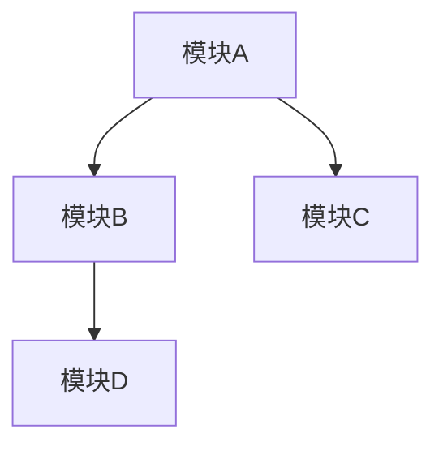
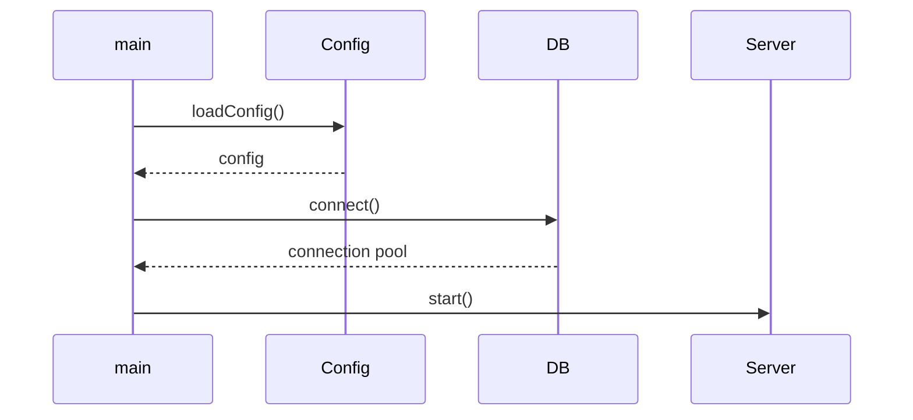
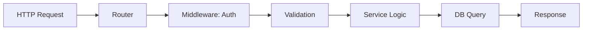
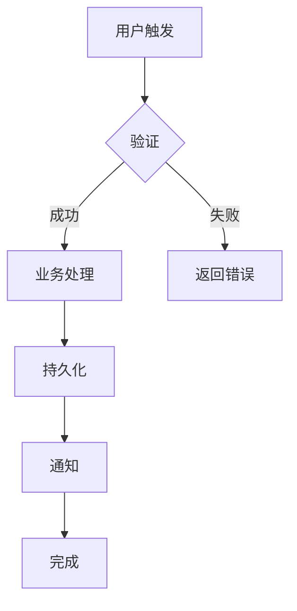

# Codebase Analyzer

## Purpose

对项目根目录下的所有代码进行全面、深入的自动化分析，生成四份**函数级粒度**的结构化 Markdown 报告，每份报告精确到每个项目运行步骤，为后续为该项目创建替代 AI Skill 提供完整的蓝图基础：

1. **项目架构报告** — 分层结构、模块划分、依赖关系、技术栈全景、函数级调用链
2. **项目运行原理报告** — 逐步骤启动流程、变量级数据流、状态机提取、完整错误处理链路
3. **项目工作流报告** — 开发流程、CI/CD 管线、业务工作流、决策树与异常恢复路径
4. **AI 工作流替代方案报告** — 函数级可行性评估、接口契约定义、Skill Blueprint 设计规格

> **定位**：本 Skill 生成详细程度达到"可直接用于 Skill 创建"的报告。报告中的 AI 替代方案章节包含每个可替代组件的完整 Skill Blueprint（名称、触发器、接口合约、工作流步骤），后续可由 `skill-for-skills` 或其他工具直接基于蓝本创建对应 Skill。**本 Skill 自身仅生成报告，不创建 Skill。**

## When to Use

- 用户要求"分析一下当前项目的架构"、"讲一下项目是怎么组织的"
- 用户要求"分析项目运行原理"、"数据是怎么流动的"、"启动流程是怎样的"
- 用户要求"项目工作流分析"、"团队的开发流程"、"CI/CD 是怎样的"
- 用户要求"哪些部分可以用 AI 替代"、"AI 工作流改造"、"AI 自动化分析"
- 用户新接手一个项目、需要进行项目尽调或技术复盘
- 用户需要对项目进行文档化，生成架构文档或技术白皮书
- **用户要求"为项目生成 Skill 蓝图"、"分析项目以便后续创建替代 Skill"、"详细分析每个运行步骤"**
- **用户要求"函数级分析"、"逐步骤精确到每个函数"、"每个函数的调用链分析"**

## When NOT to Use

- 用户只想了解项目的一句话摘要而非深度分析 —— 询问用户是否需要启动完整分析
- 用户要求"直接为项目创建 AI Skill" —— 应当使用 `skill-for-skills` 而非本 Skill（本 Skill 只生成报告，不创建 Skill）
- 用户只需要修改或调试特定的一小段代码、处理具体 bug —— 不需要全项目分析
- 用户要求分析的目标不是代码项目（如纯文档仓库、设计稿仓库）—— 分析价值有限

## Workflow

> **注意**：本 Skill 以 `context: fork` 模式在隔离子 Agent 中运行。子 Agent 拥有独立的上下文窗口用于深度分析，分析完成后自动向用户报告结果。

### 阶段一：项目发现与画像

#### Step 1: 确定分析范围

解析用户输入的 `$ARGUMENTS`：
- 如果包含路径参数（如 `src/`、`packages/core/`），将该路径作为分析根目录
- 如果无参数或参数为空，将当前工作目录（`pwd`）作为分析根目录
- 如果参数是具体文件名，提示用户需要的是目录而非文件，并询问是否正确
- 记录 `ANALYSIS_ROOT` 和当前时间戳 `TIMESTAMP`（格式 `YYYY-MM-DD_HHmmss`）

#### Step 2: 快速项目画像（30 秒扫描）

使用 `Glob` 和 `Bash` 工具快速完成以下扫描，建立项目的第一印象：

**2a. 扫描顶级目录结构：**
```
Bash ls -la ANALYSIS_ROOT | head -80
```

**2b. 识别构建/配置文件，判断技术栈：**

按以下优先级查找配置文件，每个找到的文件记录其完整路径：

| 技术栈 | 标志性文件 |
|--------|-----------|
| Node.js / TypeScript / JavaScript | `package.json`, `tsconfig.json`, `yarn.lock`, `pnpm-lock.yaml`, `bun.lockb` |
| Python | `requirements.txt`, `pyproject.toml`, `setup.py`, `Pipfile`, `poetry.lock` |
| Rust | `Cargo.toml`, `Cargo.lock` |
| Go | `go.mod`, `go.sum` |
| Java / Kotlin | `pom.xml`, `build.gradle`, `build.gradle.kts`, `settings.gradle` |
| .NET / C# | `*.csproj`, `*.sln`, `global.json` |
| Ruby | `Gemfile`, `*.gemspec` |
| PHP | `composer.json` |
| Docker | `Dockerfile`, `docker-compose.yml` |
| CI/CD | `.github/workflows/`, `.gitlab-ci.yml`, `Jenkinsfile` |
| 编辑器/IDE | `.vscode/`, `.idea/`, `*.code-workspace` |

使用 `Read` 读取核心配置文件的头部关键区域（如 `package.json` 的 `dependencies`/`scripts`、`Cargo.toml` 的 `dependencies`、`pyproject.toml` 的 `project.dependencies`）。

**2c. 统计代码规模：**
```
Glob ANALYSIS_ROOT/**/*.{js,ts,tsx,jsx,py,rs,go,java,kt,kts,cs,rb,php,c,cpp,h,hpp,swift}
```
- 统计各语言的代码文件数、估算文件分布
- 如果文件总数超过 500，记录为"大型项目"，后续采用采样分析策略
- 如果文件总数少于 50，记录为"小型项目"，后续可进行完整分析

**2d. 扫描 Git 元数据（如存在 `.git`）：**
```
Bash git log --oneline -30
Bash git log --format="%an" | sort | uniq -c | sort -rn
```
- 获取近期活跃度、贡献者分布、分支策略（如存在 `main`、`develop`、`release/*` 等模式）
- 如果不存在 `.git`，注明"未发现 Git 仓库"

**2e. 输出项目快照卡片：**

将以上发现汇总为一个精简快照，用于指导后续深入分析的优先级：

```markdown
## 项目快照
- **项目名称**：从配置推断（如 `package.json#name` / `Cargo.toml#package.name`）
- **技术栈**：[技术栈列表]
- **代码规模**：X 个文件，估计 X 行代码
- **语言分布**：[语言文件数排行]
- **构建工具**：[构建工具列表]
- **CI/CD**：[CI 工具]
- **分支策略**：[Git 工作流模式]
- **贡献者**：X 人活跃
- **分析模式**：完整分析 / 采样分析
```

### 阶段二：深度架构分析

#### Step 3: 构建目录结构全景

**3a. 使用 `Glob` 获取完整目录树（排除 `node_modules`、`.git`、`dist`、`build`、`target`、`__pycache__`、`.next`、`venv`、`.venv` 等生成目录）：**

对中型项目（50-500 文件），列出完整目录树。对大型项目（500+ 文件），仅列出 4 层深度的主要结构并在关键目录下展开。

输出格式：
- 仅显示目录和关键文件（入口文件、配置文件、核心模块文件）
- 用 Mermaid 或缩进树格式呈现

**3b. 标注目录功能角色：**

对每个主要目录（`src/`、`lib/`、`app/`、`packages/`、`components/`、`services/`、`api/`、`utils/`、`core/` 等），标注其功能角色：

- **入口层**：`main.ts`、`app.js`、`index.ts` 等
- **表现层**：`components/`、`pages/`、`views/`、`templates/`
- **业务逻辑层**：`services/`、`usecases/`、`domain/`、`logic/`
- **数据访问层**：`repositories/`、`dao/`、`models/`、`database/`
- **基础设施层**：`config/`、`middleware/`、`utils/`、`helpers/`
- **外部接口层**：`api/`、`graphql/`、`grpc/`、`webhooks/`

#### Step 4: 核心模块深度追踪

**4a. 识别入口文件与初始化链路：**

查找并读取项目入口文件（按技术栈推断）：
- Node.js: `src/index.ts`, `src/app.ts`, `src/main.ts`, `index.js`, `app.js`
- Python: `main.py`, `app.py`, `manage.py`, `__init__.py`(在包的主目录中)
- Rust: `src/main.rs`, `src/lib.rs`
- Go: `main.go`, `cmd/`
- 通用: `bin/`, `cli.js`, `cli.py`

记录入口文件的执行流程：创建了什么实例、加载了什么配置、注册了什么路由/处理器、启动了什么服务。

**4b. 追踪模块间依赖关系：**

使用 `Grep` 搜索以下模式来构建依赖图：

| 语言 | 导入搜索模式 |
|------|-------------|
| TypeScript/JavaScript | `import.*from`, `require\(`, `import(` |
| Python | `import `, `from ... import` |
| Rust | `use `, `mod ` |
| Go | `import (` |
| Java/Kotlin | `import ` |
| C# | `using ` |

对核心模块文件（每个主要目录中的 1-3 个代表性文件），深度读取其导入/导出关系，构建模块间的依赖方向。使用 Mermaid 流程图表示：



**4c. 分析架构模式：**

基于发现的模块组织和依赖关系，判断项目采用的架构模式：
- **MVC / MVT** — 是否将模型、视图、控制器分离？
- **分层架构** — 是否按表现层→业务层→数据层分层？
- **模块化/微服务** — 是否拆分为独立服务或包？
- **Clean / 六边形架构** — 是否有明确的领域层和端口适配器？
- **事件驱动** — 是否有事件总线、消息队列、发布订阅模式？
- **流水线/管道** — 是否按数据处理阶段组织？

对每种识别的模式，给出判断依据（引用发现的具体文件或代码结构）。

**4d. 识别关键设计模式与约定：**

搜索常见设计模式的痕迹：
- 工厂模式：工厂函数、工厂类、`Builder`、`Factory`
- 单例模式：全局状态、单一实例类、`getInstance()`
- 策略模式：策略接口、可替换算法类
- 观察者模式：事件监听、钩子系统、回调注册
- 依赖注入：容器、`DI`、`Provider`、`inject()`
- 中间件模式：中间件链、管道、过滤器
- 仓库模式：`Repository`、数据访问封装

注意不需要详尽列出所有模式，只需标记显著出现的模式并说明其在项目中的具体使用位置。

**4e. 函数级调用链追踪（新增 — 粒度提升至函数级别）：**

对核心业务模块中的每个关键文件，通过 Grep 和 Read 追踪函数/方法的定义与调用关系：

1. **入口函数识别**：在每个核心文件中识别导出的公共函数/方法、请求处理函数、事件处理函数
2. **调用链构建**：从入口函数出发，逐层追踪其内部调用的辅助函数，构建完整的调用链：

```
入口函数 processOrder(orderId)
  ├── validateOrder(orderId)        → services/order.ts:45
  │   ├── checkInventory(items)      → services/inventory.ts:22
  │   └── verifyPayment(orderId)     → services/payment.ts:33
  ├── calculateTotal(items)          → services/pricing.ts:15
  │   └── applyDiscount(coupon)      → services/pricing.ts:42
  ├── saveOrder(orderData)           → repositories/order.ts:88
  │   └── beginTransaction()         → lib/database.ts:12
  └── sendNotification(userId)      → services/notification.ts:55
      └── pushToQueue(message)       → lib/queue.ts:30
```

3. **函数签名记录**：对调用链上的每个函数，记录其完整签名（参数类型、返回值类型、装饰器/注解）：
   ```typescript
   // 格式示例
   function validateOrder(orderId: string): Promise<ValidationResult>
   // 位置: services/order.ts:45
   // 参数: orderId - UUID格式的订单号
   // 返回: { valid: boolean, errors: string[] }
   ```
4. **跨模块调用标注**：识别哪些调用跨越了模块边界（如 service → repository、controller → service），标注为"跨层调用"
5. **异步/并发点标注**：在调用链中标记所有异步操作（Promise、async/await、回调、事件发射），标注并发控制方式

### 阶段三：运行原理分析

#### Step 5: 启动流程溯源

**5a. 从入口文件开始，追踪启动初始化序列：**

按顺序阅读入口文件及其直接调用的初始化函数/方法，记录：

1. **配置加载**：读取了哪些配置文件（`.env`、`config/*`、环境变量）
2. **依赖初始化**：数据库连接、缓存客户端、外部服务 SDK 的初始化顺序和方式
3. **中间件注册**：注册了哪些中间件/插件及顺序
4. **路由/端点注册**：注册了哪些 API 路由、页面路由、消息处理器
5. **错误处理设置**：全局错误处理器、未捕获异常处理、优雅关闭(graceful shutdown)
6. **服务启动**：HTTP 服务器、WebSocket 服务器、消息消费者、定时任务等的启动方式

**5b. 记录启动序列图：**

使用 Mermaid sequence 图记录启动流程：



#### Step 6: 数据流分析

**6a. 跟踪核心数据路径：**

选取 2-3 个核心业务功能/API 端点，从请求/输入到响应/输出完整追踪数据流：

1. **API 端点**的完整请求生命周期：
   - 路由匹配 → 中间件处理 → 参数验证 → 业务逻辑 → 数据访问 → 响应序列化 → 错误处理
   - 读取端点对应 handler/service 的代码，理解每一步的数据变换

2. **后台任务/定时任务**的数据路径：
   - 触发条件 → 数据获取 → 业务处理 → 结果写入/发送
   - 跟踪关键函数链，理解数据在函数间传递的格式和变换

3. **进程间/服务间通信**（如果适用）：
   - 消息队列的生产和消费
   - gRPC/REST 调用的序列化/反序列化
   - 事件总线的事件结构

**6b. 记录数据流图：**

为每个核心路径生成 Mermaid flow 图，标注每个步骤的数据格式（类型/结构体/接口名）：



**6c. 变量级数据变换记录（新增 — 粒度提升至变量级别）：**

对每个核心数据路径，选取调用链上 3-5 个关键函数，追踪其输入变量到输出变量的具体变换：

```markdown
### 数据变换详情：processOrder()

| 步骤 | 变量名 | 类型 | 值/状态变化 | 代码位置 |
|------|--------|------|------------|---------|
| 函数入口 | `orderId` | `string` | `"ORD-2024-001"` | order.ts:44 |
| 调用checkInventory | `items` | `OrderItem[]` | `[{sku:"A1",qty:2},...]` | order.ts:46 |
| 调用verifyPayment | `paymentResult` | `PaymentResult` | `{status:"paid",txId:"tx_123"}` | order.ts:47 |
| 计算总价 | `total` | `number` | `299.98` → `269.98`(折扣后) | order.ts:48 |
| 保存订单 | `savedOrder` | `Order` | `{id:1, total:269.98, status:"confirmed"}` | order.ts:50 |
```

**关键发现记录：**
- 数据格式变化点（如 `string` → `ParsedInput` → `DBModel` → `ResponseDTO`）
- 数据验证/清洗的边界条件（空值处理、默认值填充、格式强制转换）
- 数据转换的副作用（日志记录、缓存更新、事件触发）
- 每个变换步骤的时间复杂度标注（O(1)、O(n)、O(n²)）

#### Step 7: 状态管理与持久化分析

**7a. 分析状态管理方式：**
- **应用状态**：全局变量、状态管理库（Redux、Zustand、Vuex、Pinia）、Context API
- **缓存状态**：Redis/Memcached 使用模式、缓存键设计、失效策略
- **会话状态**：会话存储策略（JWT、Session、Cookie）、认证状态管理

**7b. 分析数据持久化层：**
- **数据库类型**：关系型（PostgreSQL、MySQL）、文档型（MongoDB）、键值型（Redis）
- **ORM/查询构建器**：TypeORM、Prisma、SQLAlchemy、Diesel、sqlx、GORM
- **数据模型/实体**：核心数据模型的结构、关系、索引
- **迁移策略**：数据库迁移工具、迁移文件组织方式
- **如果没有数据库**：说明数据如何持久化（文件系统、内存、第三方 API）

**7c. 分析异常与错误处理：**
- **错误类型**：自定义错误类型/异常类的层次结构
- **错误传播**：错误如何从底层传递到顶层（Result 类型、异常抛出、错误码返回）
- **全局处理**：全局错误处理器的行为（日志、告警、响应格式化）
- **重试策略**：重试模式、退避策略、熔断器

**7d. 状态机提取（新增 — 粒度提升至状态级）：**

从代码中提取核心对象/实体的状态机模型：

1. **状态枚举**：找出实体（如 Order、User、Task）的所有可能状态值：
   ```typescript
   // 从 types/order.ts:10 提取
   enum OrderStatus {
     PENDING, CONFIRMED, PROCESSING, SHIPPED, DELIVERED, CANCELLED, REFUNDED
   }
   ```
2. **状态转换规则**：追踪每个允许的状态转换及其触发条件：
   ```markdown
   | 当前状态 | 目标状态 | 触发操作 | 条件 | 代码位置 |
   |---------|---------|---------|------|---------|
   | PENDING | CONFIRMED | confirmOrder() | 支付成功 | order.ts:60 |
   | CONFIRMED | PROCESSING | startProcessing() | 库存充足 | order.ts:78 |
   | CONFIRMED | CANCELLED | cancelOrder() | 用户请求 | order.ts:95 |
   | PROCESSING | SHIPPED | shipOrder() | 物流单号生成 | order.ts:110 |
   ```
3. **非法转换检测**：标记代码中可能尝试的非法状态转换（如直接从 PENDING → SHIPPED）
4. **状态持久化**：状态变更时的持久化策略（直接写入 DB、事件溯源、快照）

**7e. 生命周期钩子分析（新增）：**

识别框架/中间件提供的生命周期钩子及其注册顺序：

```markdown
| 钩子类型 | 注册顺序 | 处理逻辑 | 代码位置 |
|---------|---------|---------|---------|
| onRequest | 1st | 请求日志、请求ID注入 | middleware/logger.ts |
| preAuth | 2nd | Token 解析、身份验证 | middleware/auth.ts |
| postAuth | 3rd | 权限校验、角色授权 | middleware/rbac.ts |
| preHandler | 4th | 参数校验、DTO转换 | middleware/validate.ts |
| postHandler | 5th | 响应格式化、缓存写入 | middleware/response.ts |
| onError | last | 错误分类、告警通知 | middleware/error.ts |
```

- 如果项目使用 Express/Fastify/Spring/ASP.NET 等有明确中间件链的框架，提取完整的中间件注册顺序
- 如果项目使用自定义的生命周期管理，通过搜索 `before*`、`after*`、`on*`、`pre*`、`post*` 钩子模式提取

### 阶段四：工作流分析

#### Step 8: 开发与交付工作流

**8a. 分析 CI/CD 管线：**

读取 `.github/workflows/`、`.gitlab-ci.yml`、`Jenkinsfile` 等 CI 配置文件：
- **触发条件**：哪些分支/标签/事件触发
- **阶段(Stage)**：lint → test → build → deploy 的编排顺序
- **测试矩阵**：多版本、多平台、多依赖组合测试
- **部署策略**：环境划分、部署方式（滚动/蓝绿/金丝雀）、回滚机制

如果未发现 CI 配置，记录"未发现 CI/CD 配置"并在 AI 替代方案中给出建议。

**8b. 分析测试策略：**

通过搜索 `test/`、`tests/`、`__tests__/`、`*.test.*`、`*.spec.*` 识别测试文件：

| 测试类型 | 搜索模式 | 应回答问题 |
|---------|---------|-----------|
| 单元测试 | `*.test.ts`, `*.spec.py`, `_test.go` | 测试覆盖率重点、使用的测试框架 |
| 集成测试 | `test/integration/`, `tests/api/` | 测试了哪些外部依赖 |
| E2E 测试 | `cypress/`, `playwright/`, `e2e/` | 端到端测试覆盖范围 |
| 测试配置 | `jest.config.*`, `vitest.config.*`, `.pytest.ini` | 测试框架与配置细节 |

记录：测试框架、测试数量估算、测试目标（哪些模块有/没有测试）、测试覆盖率高低判断。

#### Step 9: 业务工作流映射

**9a. 识别核心业务流程：**

从代码结构推断项目的核心业务领域：
- 路由/端点名称：`/users/*`、`/orders/*`、`/payments/*`
- 目录/模块名称：`user/`、`order/`、`payment/`、`notification/`
- 核心数据结构名：`User`、`Order`、`Product`、`Invoice`
- 任务/作业名称：`ReportGenerator`、`EmailSender`、`DataSync`

列出 3-5 个核心业务流程，每个包含：
- 流程名称和一句话描述
- 涉及的主要代码模块/文件（用路径引用）
- 参与的角色或系统（用户、管理员、外部系统、定时器）

**9b. 为每个核心流程绘制工作流图：**



**9c. 决策树提取（新增 — 粒度提升至每个业务判断点）：**

对每个核心业务流程，读取其涉及的业务逻辑代码，提取完整的决策树：

1. **条件分支记录**：对流程中的每个 if/else/switch/pattern match，记录判断条件、分支路径和执行逻辑：

```markdown
### 决策树：用户注册流程

条件链（从 controllers/auth.ts:30 至 services/auth.ts:80）：
├── 条件1: email 格式是否合法? (validate.ts:22)
│   ├── 否 → 返回 400: "邮箱格式不正确"
│   └── 是 → 条件2: email 是否已注册? (auth-service.ts:45)
│       ├── 是 → 返回 409: "邮箱已被注册"
│       └── 条件3: 密码强度 >= 8? (auth-service.ts:52)
│           ├── 否 → 返回 400: "密码强度不足"
│           └── 执行创建用户 → 条件4: 创建成功? (auth-service.ts:70)
│               ├── 否 → 返回 500: "创建失败，请重试"
│               └── 返回 201: 创建成功
```

2. **业务规则量化**：提取代码中硬编码的业务规则阈值和常量：
   - `MAX_LOGIN_ATTEMPTS = 5`（`services/auth.ts:12`）
   - `SESSION_TIMEOUT_MS = 3600000`（`config/auth.ts:8`）
   - `MIN_PASSWORD_LENGTH = 8`（`validators/user.ts:15`）

3. **条件复杂度评估**：对每个条件点评估其复杂度（简单布尔判断 / 多条件组合 / 外部状态依赖）
4. **缺少的分支标记**：如果发现某些条件缺少 else/默认分支，标记为"潜在缺陷"

**9d. 异常恢复路径分析（新增）：**

对每个核心流程，识别并记录其异常恢复机制：

```markdown
| 流程步骤 | 可能失败点 | 异常处理方式 | 恢复策略 | 代码位置 |
|---------|-----------|------------|---------|---------|
| 创建用户 | 数据库写入失败 | try-catch | 重试3次 + 回滚事务 | auth-service.ts:70-85 |
| 发送邮件 | SMTP 服务超时 | 异步队列 | 入队重试，最多5次 | email.ts:22-35 |
| 支付处理 | 第三方 API 返回 5xx | 熔断器 | 中断30s后恢复 | payment.ts:45-60 |
```

- 对于没有异常恢复机制的流程步骤，标记为"缺乏容错"
- 记录重试间隔策略（固定间隔 / 指数退避 / 随机抖动）

### 阶段五：AI 工作流替代方案分析

#### Step 10: 模块级 AI 替代可行性评估

**10a. 对每个主要模块/功能领域，从以下维度评估 AI 替代可行性：**

对每个模块，逐一评估以下 6 个维度，生成结构化评估表：

| 维度 | 评估内容 | 评分（1-5） |
|------|---------|------------|
| 确定性 | 该任务的输出是否可预测、有标准答案 | 1=高度创造性 5=完全确定性 |
| 输入结构化程度 | 输入是否结构化、边界清晰 | 1=模糊开放 5=严格结构化 |
| 安全风险 | 出错时的潜在影响 | 1=灾难性 5=无影响 |
| 领域复杂度 | 是否需要深层领域知识 | 1=需要专家 5=通用知识 |
| 上下文窗口需求 | 处理单个任务需要的信息量 | 1=整个代码库 5=局部信息 |
| 重复性 | 任务发生的频率和模式稳定性 | 1=一次性 5=高频重复 |

**10b. 替代方案分类体系：**

根据评分总和，将模块分为三个等级：

| 等级 | 总分范围 | 替代策略 | 示例 |
|------|---------|---------|------|
| **🤖 完全 AI 化** | 24-30 | AI 可直接执行，无需人工介入 | 代码格式化、文档生成、类型生成、模板代码、标准 CRUD API |
| **🧑‍💻 AI 辅助** | 15-23 | AI 生成初稿/提供建议，人工审核后落地 | 单元测试编写、代码重构建议、数据迁移脚本、配置生成、简单业务逻辑 |
| **👤 人工主导** | 6-14 | AI 仅提供参考信息，核心判断由人完成 | 架构决策、安全审计、复杂业务规则、谈判逻辑、战略方向 |

**10c. 为每个模块生成具体替代方案卡片：**

```markdown
### [模块名] — 🧑‍💻 AI 辅助（总分：20/30）

**当前状态**：人工编写 SQL 查询映射到数据模型
**AI 替代方式**：使用 AI 生成 ORM 查询代码，人工 review
**实施难度**：低 — 引入 AI 代码补全工具即可
**预期收益**：减少 60% 样板代码编写时间
**优先级**：⭐ 高（ROI 最高）

**推荐实施方案**：
1. 配置 Claude Code 读取现有 Repository 模式作为 context
2. 开发新查询时，用自然语言描述查询需求 + 引用模型定义
3. AI 生成查询代码，开发者检查正确性和性能
4. 复杂查询保留人工编写 + AI review 模式

**风险与限制**：
- 复杂多表 JOIN 查询 AI 可能生成次优方案
- 需要建立清晰的模型定义文档供 AI 参考
```

**10d. 函数级替代粒度分析（新增 — 粒度提升至单个函数）：**

对 10c 中标记为"🤖 完全 AI 化"或"🧑‍💻 AI 辅助"的模块，进一步下钻到函数级别：

1. **函数清单提取**：列出该模块中所有公共函数/方法，记录签名和位置：
   ```markdown
   | 函数名 | 签名 | 位置 | 行数 | AI替代潜力 |
   |--------|------|------|------|-----------|
   | createUser | (data: CreateUserDTO) => Promise<User> | services/user.ts:22 | 15 | 完全 AI 化 |
   | findById | (id: string) => Promise<User \| null> | services/user.ts:45 | 8 | 完全 AI 化 |
   | updateProfile | (id: string, data: UpdateDTO) => Promise<User> | services/user.ts:60 | 20 | AI 辅助 |
   | deleteUser | (id: string) => Promise<void> | services/user.ts:88 | 10 | 完全 AI 化 |
   ```

2. **函数复杂度评估**：对每个函数评估其实现复杂度：
   - **圈复杂度**（条件分支数量）：`createUser` = 4（含验证、重复检查、创建、通知）
   - **外部依赖数**（调用的外部函数/服务数量）：`createUser` = 5（db、email、cache、log、validator）
   - **副作用分析**：`createUser` 写 DB + 发送邮件 + 更新缓存（3 个副作用）
   - **代码行数**：直接反映理解成本

3. **接口契约提取**：对每个函数，提取完整的接口契约：
   ```markdown
   ### createUser 接口契约

   **前置条件**：
   - 数据库连接可用
   - email 未被注册
   - 请求中的 `role` 必须是有效角色枚举值

   **后置条件**：
   - 用户记录写入 `users` 表
   - 发送欢迎邮件到用户邮箱
   - 清除相关缓存键 `user_cache:*`

   **不变式**：
   - email 字段在系统中全局唯一
   - 用户状态初始为 `PENDING_VERIFICATION`

   **错误场景**：
   | 错误 | 触发条件 | 返回值 |
   |------|---------|--------|
   | DuplicateEmailError | email 已存在 | 409 { code: "EMAIL_EXISTS" } |
   | ValidationError | 必填字段缺失 | 400 { code: "VALIDATION_ERROR", fields: [...] } |
   | DatabaseError | 写入失败 | 500 { code: "INTERNAL_ERROR" } |
   ```

**10e. 依赖与上下文需求分析（新增）：**

对每个函数/模块，分析创建 AI Skill 所需的上下文信息：

```markdown
| 依赖类型 | 具体内容 | 来源位置 | AI Skill 所需 Context |
|---------|---------|---------|---------------------|
| 数据模型 | User, CreateUserDTO | types/user.ts:5,15 | 完整的类型定义 |
| 配置项 | MAX_USERS_PER_IP, PASSWORD_POLICY | config/auth.ts:8,12 | 配置常量和业务规则 |
| 外部服务 | EmailService, CacheService | services/email.ts, lib/cache.ts | API 文档或接口签名 |
| 内部依赖 | ValidationUtils, Logger | utils/validate.ts, lib/logger.ts | 工具函数签名 |
| 测试用例 | createUser.test.ts:30-80 | tests/unit/user.test.ts | 典型输入/输出示例 |
```

- 对于标记为"完全 AI 化"的函数，列出创建 Skill 所需的完整 context 清单
- 对于标记为"AI 辅助"的函数，标注需要人工介入的审查点

#### Step 11: 生成 ROI 优先级矩阵

**11a. 基于"实施难度"和"预期收益"两个维度，将所有建议排序：**

```
高收益 + 低难度 → 🥇 立即实施（Quick Win）
高收益 + 高难度 → 🥈 规划实施（Strategic）
低收益 + 低难度 → 🥉 逐步推进（Incremental）
低收益 + 高难度 → 📋 暂时搁置（Low Priority）
```

**11b. 输出综合 AI 改造路线图：**

```markdown
## AI 改造路线图

### Phase 1 — Quick Wins（本月）
1. [模块A] 引入 AI 代码生成 — 预期减时 60%
2. [模块B] 自动化文档生成 — 预期减时 80%

### Phase 2 — Strategic（本季度）
3. [模块C] AI 辅助测试生成 — 预期减时 50%
4. [模块D] 代码审查自动化 — 预期提升质量 30%

### Phase 3 — Transformative（本年度）
5. [模块E] AI 驱动代码重构 — 预期减时 70%
6. [模块F] 全面 AI Code Review 流程 — 预期缺陷减少 40%
```

### 阶段六：Skill Blueprint 生成（新增）

> Skill Blueprint 是本报告的核心产出之一。每个 Blueprint 是一份自包含的 Skill 设计规格，详细定义了一个可被 AI 替代的组件所需的全部信息。后续可直接由 `skill-for-skills` 或其他工具基于 Blueprint 创建对应的 Claude Code Skill。

#### Step 12: 为可替代组件生成 Skill Blueprint

**12a. 筛选候选组件：**

从 Step 10 的评估结果中，筛选出满足以下任一条件的组件：

| 条件 | 说明 | 操作 |
|------|------|------|
| 完全 AI 化（24-30 分） | AI 可直接替代 | 必须生成完整 Blueprint |
| AI 辅助（15-23 分）+ 高优先级 | 高 ROI 的 AI 辅助项 | 生成含人工审查点的 Blueprint |
| Quick Win（🥇） | 高收益低难度 | 优先生成，标注"可立即实施" |

**12b. 为每个候选组件生成结构化 Blueprint：**

每个 Blueprint 是一个独立的 Markdown 文件，保存在 `codebase-analyzer/reports/<project-name>-<TIMESTAMP>/blueprints/` 目录下：

```markdown
# Skill Blueprint: [组件名]

> 自动生成自 codebase-analyzer
> 分析时间：<TIMESTAMP>
> 源模块路径：<ANALYSIS_ROOT>/<模块路径>

---

## 1. 基本信息

| 字段 | 值 |
|------|-----|
| **推荐 Skill 名称** | `<project>-<component>-handler` |
| **用途** | 一句话描述该 Skill 的用途 |
| **AI 替代等级** | 🤖 完全 AI 化 / 🧑‍💻 AI 辅助 |
| **实施优先级** | 🥇 Quick Win / 🥈 Strategic |
| **源文件数** | X |
| **源代码行数** | ~X |

## 2. 触发场景与关键词

用户在什么情况下会触发该 Skill：
- "[场景 1 的自然语言描述]"
- "[场景 2 的自然语言描述]"
- "[场景 3 的自然语言描述]"

**推荐 description 触发词（用于 SKILL.md frontmatter）：**
```yaml
description: >-
  [英文功能描述]。Triggered by: "[触发词1]", "[触发词2]", "[触发词3]".
```

## 3. 输入输出契约

### 主要函数接口

| 函数 | 输入 | 输出 | 副作用 | 代码位置 |
|------|------|------|--------|---------|
| `func1` | `ParamType` → 说明 | `ReturnType` → 说明 | 是否有副作用 | `<path>:<line>` |
| `func2` | ... | ... | ... | ... |

### 数据模型

```typescript
// 从源代码提取的核心数据模型（或等效的类型描述）
interface ExampleModel {
  id: string;       // UUID
  name: string;     // 显示名称
  status: 'active' | 'inactive';  // 状态枚举
}
```

### 错误码

| 错误码 / 异常 | 触发条件 | HTTP 状态码 |
|--------------|---------|------------|
| `ERROR_CODE_1` | 条件描述 | 4xx / 5xx |
| `ERROR_CODE_2` | 条件描述 | 4xx / 5xx |

## 4. 依赖清单

### 外部服务
| 服务 | 用途 | API 文档（如有） |
|------|------|----------------|
| ServiceA | 描述 | 链接或接口签名 |
| ServiceB | 描述 | 链接或接口签名 |

### 内部模块
| 模块 | 用途 | 关键接口 |
|------|------|---------|
| ModuleA | 描述 | 接口签名 |
| ModuleB | 描述 | 接口签名 |

### 配置项
| 配置键 | 类型 | 默认值 | 说明 |
|--------|------|--------|------|
| `MAX_RETRIES` | number | 3 | 最大重试次数 |
| `TIMEOUT_MS` | number | 5000 | 超时毫秒数 |

## 5. Skill 工作流设计

### 建议的 Workflow 步骤

```markdown
## Workflow / Steps

### Step 1: 解析输入
[描述如何从用户输入中解析参数]

### Step 2: 验证输入
[描述验证逻辑和规则]

### Step 3: 执行业务逻辑
[描述核心业务处理步骤]

### Step 4: 处理结果
[描述如何格式化和返回结果]

### Step 5: 错误处理
[描述各类错误的处理方式]
```

### 建议的 Constraints

```markdown
## Constraints
- Always [必须遵守的规则 1]
- Always [必须遵守的规则 2]
- Never [禁止行为 1]
- Never [禁止行为 2]
```

## 6. 所需工具权限

| 工具 | 用途 | 必需性 |
|------|------|--------|
| `Read` | 读取配置文件 | 必需 |
| `Write` | 写入输出文件 | 必需 |
| `Grep` | 搜索相关代码 | 可选 |
| ... | ... | ... |

**建议 allowed-tools：** `Read Write Grep`

## 7. 使用示例

### ✅ Do This
```
用户输入 → 期望输出
```

### ❌ Not This
```
用户输入 → 错误输出
```

## 8. 参考材料

- 源文件：`<路径 1>`、`<路径 2>`
- 测试文件：`<测试路径>`
- 相关文档：`<文档链接>`
- 关键代码片段：[可选粘贴关键代码]
```

**12c. 生成 Blueprint 索引文件：**

在 `blueprints/` 目录下创建 `index.md`，汇总所有 Blueprint：

```markdown
# Skill Blueprint 索引

| # | Blueprint | 组件 | AI 等级 | 优先级 | 文件 |
|---|-----------|------|---------|--------|------|
| 1 | user-crud-handler | 用户 CRUD 操作 | 🤖 完全 AI 化 | 🥇 Quick Win | [blueprints/01-user-crud-handler.md](01-user-crud-handler.md) |
| 2 | order-processor | 订单处理 | 🧑‍💻 AI 辅助 | 🥈 Strategic | [blueprints/02-order-processor.md](02-order-processor.md) |

## 实施路线图

### 立即实施（Quick Win）
1. **用户 CRUD 处理** (`blueprints/01-user-crud-handler.md`) — 完全 AI 化，可直接创建 Skill

### 规划实施（Strategic）
2. **订单处理** (`blueprints/02-order-processor.md`) — 需要人工审核业务规则

### 逐步推进（Incremental）
3. ...

---

> 每个 Blueprint 文件包含了创建对应 Skill 所需的完整设计规格。
> 使用 `skill-for-skills` 加载对应 Blueprint 文件即可生成标准 SKILL.md。
```

**12d. 在报告间建立交叉引用：**

在 `04-ai-substitution.md` 报告的每个模块评估卡片末尾，添加 Blueprint 引用：
```markdown
**对应Blueprint**：[blueprints/[组件名].md](blueprints/[组件名].md)
```

### 阶段七：报告生成与输出

#### Step 13: 创建输出目录与索引

**13a. 创建报告目录结构：**

以 `ANALYSIS_ROOT` 目录名为项目名，创建完整的时间戳目录结构：

```
codebase-analyzer/reports/
└── <project-name>-<TIMESTAMP>/
    ├── index.md
    ├── 01-architecture.md
    ├── 02-operation-principles.md
    ├── 03-workflow.md
    └── 04-ai-substitution.md
```

如果 `codebase-analyzer/reports/` 目录不存在，先创建它，再在内部创建 `blueprints/` 子目录。

**13b. 使用 `references/report-templates.md` 中定义的模板生成以下报告：**

1. **`01-architecture.md`** — 架构分析报告（引用 `references/report-templates.md` 的 Architecture 模板）
2. **`02-operation-principles.md`** — 运行原理报告（引用 `references/report-templates.md` 的 Principles 模板）
3. **`03-workflow.md`** — 工作流分析报告（引用 `references/report-templates.md` 的 Workflow 模板）
4. **`04-ai-substitution.md`** — AI 替代方案报告（引用 `references/report-templates.md` 的 AI Substitution 模板）

**13c. 生成 `index.md` 汇总索引：**

```markdown
# <项目名> 代码分析报告

**分析时间**：<TIMESTAMP>
**分析范围**：<ANALYSIS_ROOT>
**分析模式**：完整/采样分析
**代码规模**：X 个文件 / ~X 行代码
**技术栈**：[技术栈]

## 报告目录

| 报告 | 内容概要 | 篇幅 |
|------|---------|------|
| [项目架构](01-architecture.md) | 分层结构、模块依赖、技术栈、设计模式 | X 页 |
| [运行原理](02-operation-principles.md) | 启动流程、数据流、状态管理、错误处理 | X 页 |
| [工作流分析](03-workflow.md) | CI/CD、测试策略、业务工作流 | X 页 |
| [AI 替代方案](04-ai-substitution.md) | 各模块 AI 替代评估、路线图、Skill Blueprint | X 页 |
| [Skill Blueprint 索引](blueprints/index.md) | 可 AI 替代组件的完整 Skill 设计规格 | X Blueprint |

## 核心发现

<3-5 条最重要的发现>

## 关键建议

<3-5 条最重要的建议>
```

#### Step 14: 向用户输出分析总结

在子 Agent 完成所有分析并生成报告后，向用户输出以下总结：

````markdown
## ✅ 项目分析完成

**项目**：[项目名]
**分析范围**：[ANALYSIS_ROOT]
**耗时**：读取了 X 个文件夹、Y 个核心文件、Z 个函数
**报告位置**：`codebase-analyzer/reports/<project-name>-<TIMESTAMP>/`

### 报告速览

| # | 报告 | 一句话要点 |
|---|------|-----------|
| 1 | [项目架构](codebase-analyzer/reports/<path>/01-architecture.md) | [架构核心特征一句话] |
| 2 | [运行原理](codebase-analyzer/reports/<path>/02-operation-principles.md) | [核心运行机制一句话] |
| 3 | [工作流分析](codebase-analyzer/reports/<path>/03-workflow.md) | [主要工作流一句话] |
| 4 | [AI 替代方案](codebase-analyzer/reports/<path>/04-ai-substitution.md) | [AI 改造核心建议一句话] |
| 5 | [Skill Blueprint](codebase-analyzer/reports/<path>/blueprints/index.md) | 生成了 N 个 Skill Blueprint 设计规格 |

### 核心发现
- [发现 1]
- [发现 2]
- [发现 3]

### 最高优先级建议
> [最重要的建议]

完整报告已保存到上述目录。每个 Blueprint 文件可直接用于 `skill-for-skills` 创建对应 Skill。
````

## Constraints

- **Always** 使用 `context: fork` 模式运行完整分析流程，保持主会话上下文的清洁
- **Always** 在分析前通过 Step 1 解析 `$ARGUMENTS` 确定分析范围
- **Always** 遵守 `.gitignore` 规则，排除生成的制品目录（`dist`、`build`、`node_modules`、`target`、`__pycache__` 等）
- **Always** 创建时间戳目录区分每次分析报告，避免覆盖历史分析结果
- **Always** 报告的每个论断必须引用具体的文件路径和行号作为证据支持
- **Always** 在报告中包含 Mermaid 图表（流程图、时序图、架构图）增强可读性
- **Always** 分析大型项目（500+ 文件）时采用采样策略：每个主要目录选取代表性文件深入阅读，而非遍历所有文件
- **Always** 在架构分析阶段（Step 4）追踪每个核心函数的完整调用链（入口→出口），至少记录关键路径上 3 层以上的函数调用
- **Always** 在运行原理分析阶段（Step 6/7）记录变量级别（variable-level）的数据变换详情，标注每个关键变量的类型变化和边界条件
- **Always** 在 AI 替代分析阶段（Step 10d/10e）提取每个候选函数的完整接口契约（前置条件、后置条件、错误场景）
- **Always** 为每个"完全 AI 化"组件生成完整的 Skill Blueprint（Step 12），包含名称、触发词、接口契约、依赖清单、工作流设计和示例
- **Never** 修改或创建分析范围（`ANALYSIS_ROOT`）内的任何源代码文件
- **Never** 执行 `Bash` 命令运行项目（如 `npm start`、`cargo run`）—— 只做静态分析
- **Never** 将代码库中的敏感信息（API 密钥、密码、令牌）写入报告文件
- Never 分析 `node_modules/`、`.git/`、`vendor/`、`.next/`、`venv/`、`.venv/` 等非项目源码目录
- 报告输出目录统一为 `codebase-analyzer/reports/<project-name>-<TIMESTAMP>/`
- Blueprint 文件统一保存在 `codebase-analyzer/reports/<project-name>-<TIMESTAMP>/blueprints/` 子目录下
- 如配置文件不存在或无法解析，记录为"未知"而非跳过分析
- 如项目规模过大导致某些步骤耗时过长，告知用户进度并询问是否继续
- 如未发现可分析的代码文件，向用户报告并建议检查目录路径

## Examples

### ✅ Do This — 全项目分析

**用户输入：**
```
/codebase-analyzer
```

**执行过程：**
1. 检测当前工作目录，扫描配置文件和目录结构
2. 发现 `package.json` + `tsconfig.json` → 判断为 TypeScript 项目
3. 检测到 `src/`、`api/`、`components/` → 判断为前端+API 混合项目
4. 读取入口文件 `src/index.ts` → 构建初始化序列
5. 追踪核心路由 → 识别用户认证、数据管理、报表三大模块
6. 扫描 `.github/workflows/` → 发现 CI 配置
7. 对每个模块进行 AI 替代可行性评估（含函数级接口契约提取）
8. 为每个高 ROI 组件生成 Skill Blueprint
9. 生成四份报告 + Skill Blueprint 索引

**输出：**
```
codebase-analyzer/reports/my-project-2026-05-19_143000/
├── index.md                           # 分析总览
├── 01-architecture.md                 # 架构报告（含函数级调用链）
├── 02-operation-principles.md         # 运行原理报告（含变量级数据流）
├── 03-workflow.md                     # 工作流报告（含决策树）
├── 04-ai-substitution.md              # AI 替代方案报告（含接口契约）
└── blueprints/                        # Skill Blueprint 目录
    ├── index.md                       # Blueprint 索引
    ├── 01-user-crud-handler.md        # 用户CRUD Skill 设计规格
    └── 02-order-processor.md          # 订单处理 Skill 设计规格
```

### ✅ Do This — 指定子目录分析

**用户输入：**
```
/codebase-analyzer packages/core
```

**执行过程：**
- `$ARGUMENTS` 解析为 `packages/core`
- 分析范围限定在 `packages/core` 目录
- 生成的报告仅覆盖该子目录结构

### ❌ Not This — 未指定参数但分析空目录

**用户执行 `/codebase-analyzer` 但当前目录无代码文件：**
- ❌ 错误做法：生成空报告，说"分析完成但没有发现任何内容"
- ✅ 正确做法：告知用户当前目录下未发现可分析的项目代码，建议：
  - 检查是否在正确的项目目录中
  - 或者指定子目录路径：`/codebase-analyzer <path>`

### ❌ Not This — 报告内容缺乏证据

- ❌ 错误做法："项目使用 MVC 架构"（无引用、无证据）
- ✅ 正确做法："项目使用 MVC 架构 — `src/controllers/` 处理请求（如 `src/controllers/userController.ts:15`），`src/models/` 定义数据模型（如 `src/models/user.ts:22`），`src/views/` 渲染响应（如 `src/views/user/profile.ejs:10`）"

### ❌ Not This — 修改源代码

- ❌ 错误做法：在分析过程中不小心编辑了 `src/config.ts` 添加注释
- ✅ 正确做法：只使用 `Read`、`Grep`、`Glob` 进行只读分析，所有输出写到 `codebase-analyzer/reports/`

## Notes

- **报告输出位置**：所有报告默认输出到项目根目录下的 `codebase-analyzer/reports/<project-name>-<TIMESTAMP>/`
- **大项目处理**：对于超过 2000 个文件的项目，自动启用增强采样策略（每类文件最多读取 10 个代表性样本），并在报告中标注"采样分析"模式
- **速度说明**：完整分析可能耗时 2-5 分钟（取决于项目规模），子 Agent 模式下用户在此期间可继续其他工作
- **`context: fork` 与 `agent: general-purpose`**：隔离分析环境确保即使分析了大量文件，主会话上下文也不受影响
- **Mermaid 图表**：报告中包含的图表在支持 Mermaid 的 Markdown 查看器（如 GitHub、VS Code 插件）中可渲染
- **Git 集成**：如果项目使用 Git，报告中会包含分支结构和贡献者活跃度信息
- **依赖版本**：报告的依赖分析基于配置文件中的声明，不执行实际的 `npm install` 或 `cargo build`
- **AI 替代方案是建议性的**：评估结果基于代码静态分析，实际 AI 替代的可行性和收益需结合业务上下文判断
- **Skill Blueprint 的用途**：每个 Blueprint 文件是一份完整的 Skill 设计规格，可直接作为 `skill-for-skills` 或手动创建 Skill 的输入。Blueprint 中包含了生成标准 SKILL.md 所需的所有信息（frontmatter、触发词、Workflow、Constraints、Examples）。**本分析 Skill 自身不创建 Skill，仅提供设计蓝图。**
- **函数级分析的前提**：函数级调用链和接口契约提取依赖于代码的可读性和结构化程度。对于高度混淆、代码生成或宏展开严重的代码，分析粒度可能降级到模块级别并在报告中标注。
- **决策树完整性**：业务规则提取（Step 9c）受限于代码中的显式条件判断。隐式规则（如业务人员的 mental model 中存在的但代码未体现的规则）不在分析范围内。
