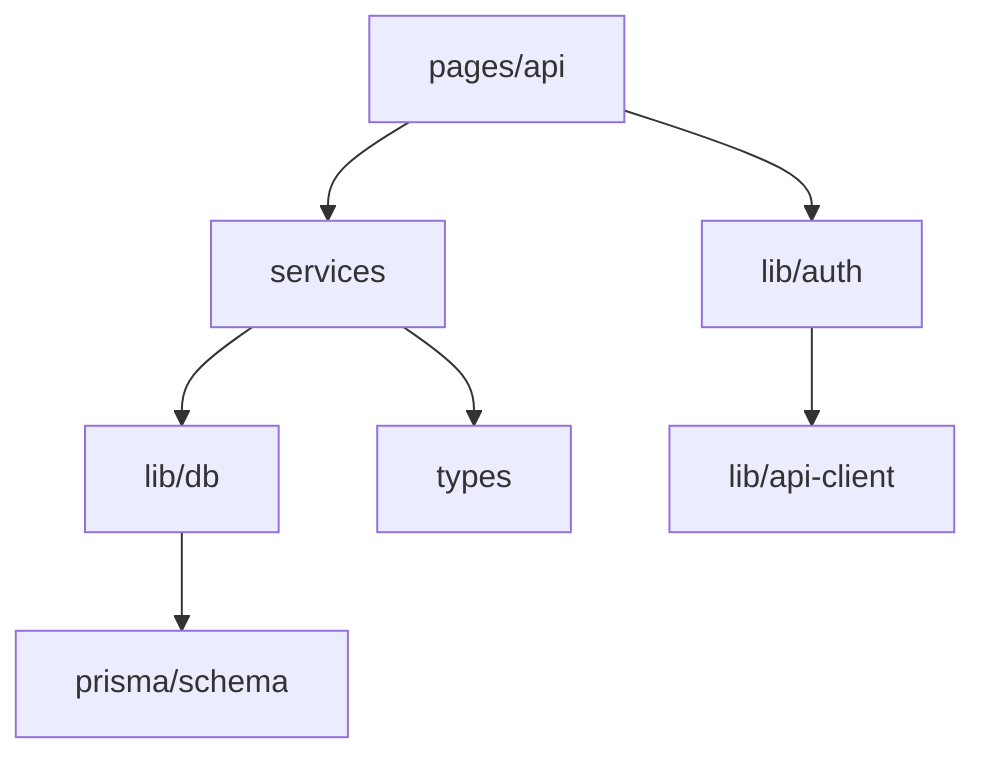
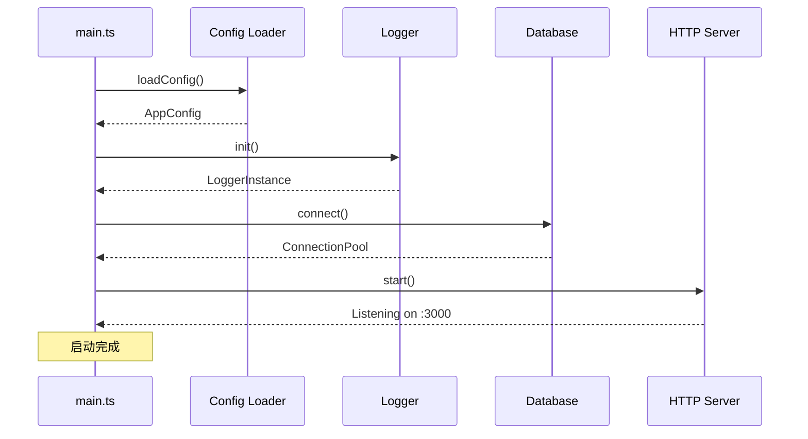
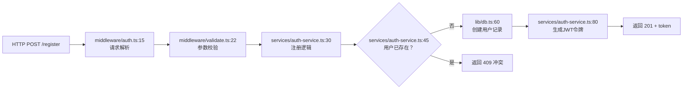
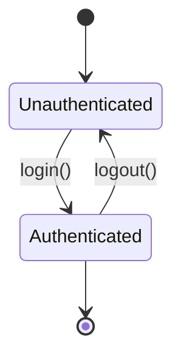
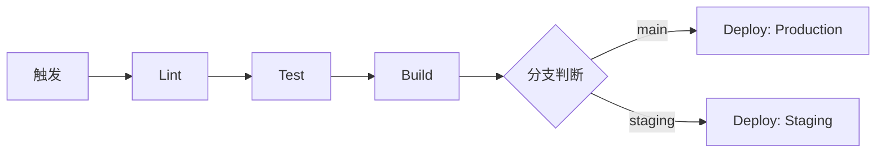
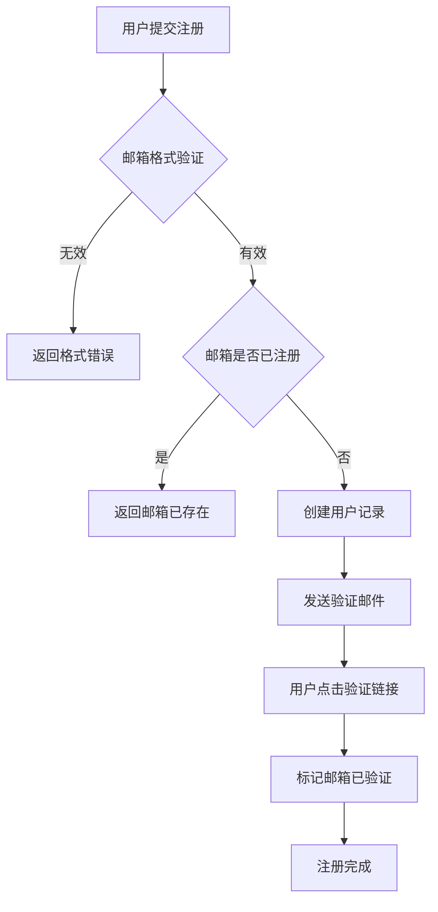
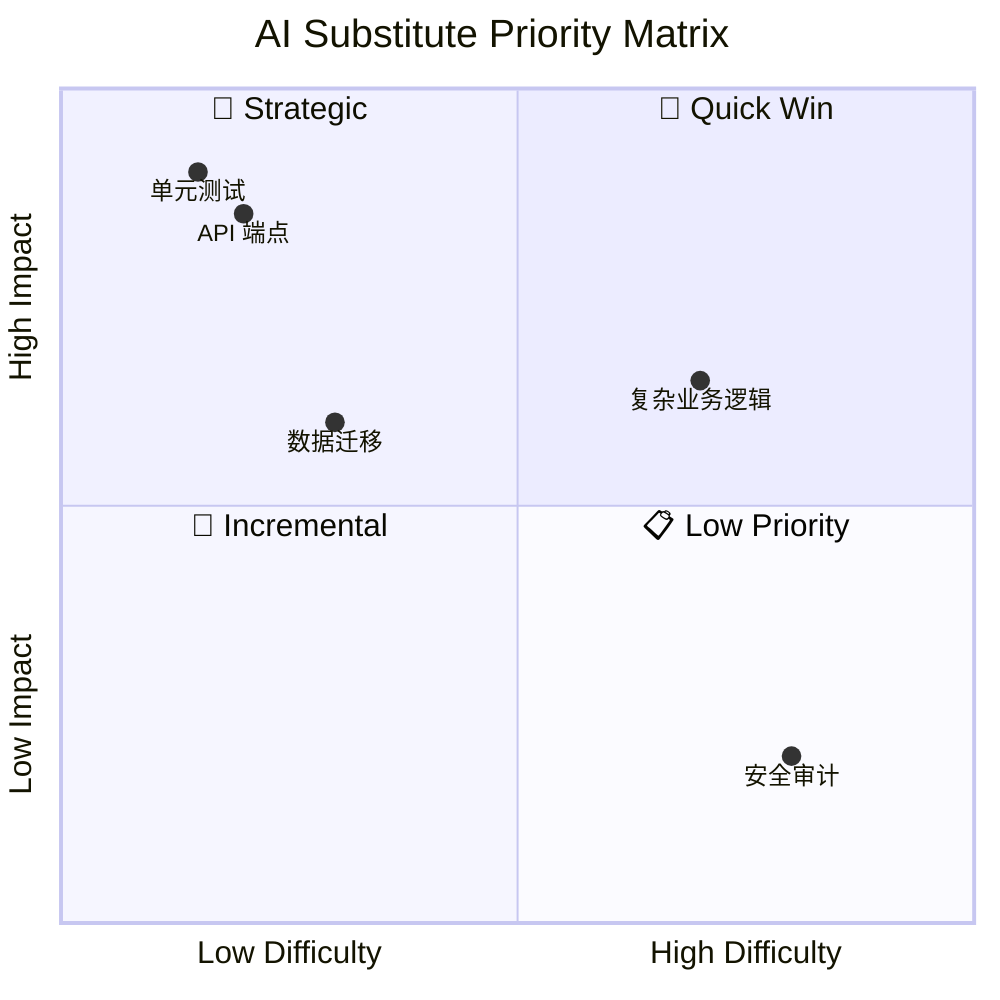

# 报告模板

本文件定义了四份核心分析报告的标准模板。在分析过程中，子 Agent 按此模板组织输出。

---

## 模板 1：项目架构报告

```
01-architecture.md
```

```markdown
# <项目名> — 项目架构报告

**分析时间**：<TIMESTAMP>
**分析范围**：<ANALYSIS_ROOT>
**分析模式**：<完整分析 | 采样分析>

---

## 1. 技术栈全景

### 编程语言
| 语言 | 文件数 | 占比 | 主要用途 |
|------|--------|------|---------|
| TypeScript | 42 | 60% | 核心业务逻辑 |
| Python | 15 | 21% | 数据处理脚本 |
| ... | | | |

### 框架与运行时
| 技术 | 版本 | 用途 | 配置文件来源 |
|------|------|------|-------------|
| Next.js | 14.2 | Web 框架 | `package.json:12` |
| Prisma | 5.x | ORM | `package.json:15` |
| ... | | | |

### 构建与工具链
- 构建工具：[名称 + 版本] — `package.json#scripts`
- 包管理器：[pnpm/npm/yarn/cargo]
- 代码检查：[ESLint/Biome/Rustfmt]
- 格式化：[Prettier/dprint]

### 外部服务与基础设施
| 服务 | 集成方式 | 代码位置 |
|------|---------|---------|
| PostgreSQL | Prisma ORM | `prisma/schema.prisma` |
| Redis | ioredis | `src/lib/redis.ts` |
| ... | | |

---

## 2. 目录结构与功能角色

```
<项目根目录>/
├── src/                           # [核心源码] 应用主代码
│   ├── app/                       # [表现层] Next.js App Router 页面
│   │   ├── layout.tsx             # 根布局
│   │   ├── page.tsx               # 首页
│   │   └── api/                   # [API 层] API 路由
│   │       ├── auth/              # 认证端点
│   │       └── users/             # 用户管理端点
│   ├── components/                # [表现层] 可复用 UI 组件
│   │   ├── ui/                    # 基础 UI 组件
│   │   └── forms/                 # 表单组件
│   ├── lib/                       # [基础设施] 工具库与配置
│   │   ├── db.ts                  # 数据库连接
│   │   ├── auth.ts                # 认证逻辑
│   │   └── api-client.ts          # 外部 API 客户端
│   ├── services/                  # [业务层] 核心业务逻辑
│   │   ├── user-service.ts
│   │   └── payment-service.ts
│   └── types/                     # [数据层] 类型定义
├── prisma/                        # [数据层] 数据库 Schema 与迁移
│   ├── schema.prisma
│   └── migrations/
├── public/                        # [静态资源]
├── tests/                         # [测试] 测试代码
├── .github/workflows/             # [CI/CD] GitHub Actions
└── config/                        # [配置] 项目配置
```

### 目录角色标注说明
- **[表现层]** — 用户界面、API 端点暴露
- **[业务层]** — 核心业务逻辑、流程编排
- **[数据层]** — 数据模型、数据库交互
- **[基础设施]** — 通用工具、配置、中间件
- **[API 层]** — 外部通信接口

---

## 3. 模块依赖关系

### 核心依赖图



### 模块间依赖分析

| 源模块 | 目标模块 | 依赖类型 | 关键代码 |
|--------|---------|---------|---------|
| `services/user-service.ts` | `lib/db.ts` | 数据访问 | `user-service.ts:10` |
| `app/api/users/route.ts` | `services/user-service.ts` | 业务调用 | `route.ts:5` |

---

## 4. 架构模式识别

### 模式 1：[模式名称 — 如"分层架构"]
- **判断依据**：[引用具体代码结构]
- **表现位置**：[文件/目录路径]
- **特征**：[特征描述]

### 模式 2：[模式名称 — 如"中间件模式"]
- **判断依据**：[引用具体代码结构]
- **表现位置**：[文件/目录路径]
- **特征**：[特征描述]

---

## 5. 关键设计模式实例

| 模式 | 位置 | 代码示例 |
|------|------|---------|
| 工厂模式 | `src/lib/api-client.ts:23` | `createClient(type): ApiClient` |
| 单例模式 | `src/lib/db.ts:5` | `globalThis.prisma` |
| 策略模式 | `src/services/payment-service.ts:30` | `PaymentStrategy.process()` |

---

## 6. 架构健康度评估

| 维度 | 评分（1-5） | 说明 |
|------|------------|------|
| 模块化程度 | 4 | 各层职责清晰，边界分明 |
| 依赖管理 | 3 | 存在少量循环引用（见 `services/user-service.ts:15` → `services/index.ts:8`） |
| 可测试性 | 4 | 大量使用依赖注入，便于 Mock |
| 文档一致性 | 2 | 部分模块缺乏接口文档 |
| 技术债务 | 3 | 少量 TODO 遗留（共 12 处，集中在 `legacy/` 目录） |
```

---

## 模板 2：运行原理报告

```
02-operation-principles.md
```

```markdown
# <项目名> — 项目运行原理报告

**分析时间**：<TIMESTAMP>
**分析范围**：<ANALYSIS_ROOT>

---

## 1. 启动初始化序列

### 入口文件
**路径**：`<入口文件路径>`
**角色**：<应用/服务/CLI 入口>

### 初始化步骤

| 步骤 | 操作 | 代码位置 | 说明 |
|------|------|---------|------|
| 1 | 加载环境配置 | `main.ts:5` | 读取 `.env` 文件 |
| 2 | 初始化日志系统 | `main.ts:8` | 配置日志级别和输出 |
| 3 | 连接数据库 | `main.ts:12` | 创建连接池 |
| 4 | 注册中间件 | `main.ts:20` | 认证、CORS、限流 |
| 5 | 注册路由 | `main.ts:35` | 注册 API 路由 |
| 6 | 启动 HTTP 服务器 | `main.ts:42` | 监听 3000 端口 |

### 启动时序图



### 优雅关闭机制
- **信号处理**：`SIGTERM` / `SIGINT` → `src/index.ts:50`
- **关闭顺序**：停止接收请求 → 等待活跃请求完成 → 关闭数据库连接 → 释放资源

---

## 2. 核心数据流追踪

### 数据流 1：[流程名称 — 如"用户注册"]

**触发方式**：`POST /api/auth/register`

**完整路径**：



**数据变换**：

| 阶段 | 数据结构 / 类型 | 代码位置 |
|------|---------------|---------|
| 请求体 | `RegisterRequest { email, password, name }` | `types/auth.ts:5` |
| 校验后 | `ValidatedRequest { email, hashedPassword, name }` | `services/auth-service.ts:35` |
| 存储 | `User { id, email, passwordHash, name, createdAt }` | `prisma/schema.prisma:10` |
| 响应 | `AuthResponse { token, user: UserProfile }` | `types/auth.ts:15` |

---

### 数据流 2：[流程名称]

...（同上结构）

---

## 3. 状态管理分析

### 应用状态
| 状态类型 | 管理方式 | 存储位置 | 关键代码 |
|---------|---------|---------|---------|
| 全局配置 | 环境变量 + 配置对象 | `src/config/` | `config/index.ts:10` |
| 用户会话 | JWT Token | 客户端存储 | `services/auth.ts:25` |
| 缓存数据 | Redis | `src/lib/cache.ts` | `cache.ts:15` |

### 状态流转图（可选）



---

## 4. 数据持久化分析

### 数据库
- **类型**：<PostgreSQL / MySQL / MongoDB / SQLite>
- **连接方式**：<Prisma / TypeORM / SQLAlchemy / 原生驱动>
- **连接配置位置**：`<文件路径>`

### 核心数据模型

| 模型 | 对应表 | 主要字段 | 关联关系 |
|------|--------|---------|---------|
| `User` | `users` | id, email, name | 1:N → Post |
| `Post` | `posts` | id, title, content, authorId | N:1 → User |
| ... | | | |

### 数据迁移策略
- **迁移工具**：<工具名>
- **迁移文件位置**：`<路径>`
- **当前版本**：<版本号>
- **策略说明**：<描述>

---

## 5. 错误处理体系

### 错误类型层次
```typescript
// 从 src/errors/ 提取
AppError
├── ValidationError      // 输入校验失败
├── AuthenticationError  // 认证失败
├── NotFoundError        // 资源不存在
└── RateLimitError       // 限流触发
```

### 错误传播机制
- **底层 → 上层**：<异常抛出 / Result 类型 / 错误码返回>
- **全局处理器**：`<文件路径:行号>`
- **错误响应格式**：`{ error: { code, message, details? } }`

### 关键异常处理点

| 操作 | 错误处理方式 | 代码位置 |
|------|------------|---------|
| 数据库连接失败 | 重试 3 次 + 退避 1s | `lib/db.ts:22` |
| API 调用超时 | 熔断 + 降级返回缓存 | `lib/api-client.ts:45` |
| 输入校验失败 | 返回 400 + 字段级错误 | `middleware/validate.ts:30` |

---

## 6. 并发与异步处理

- **并发模型**：<async/await / 线程 / goroutine / 回调>
- **异步队列**：<Bull / Celery / 内置队列>
- **竞态处理**：<锁 / 乐观锁 / 事务隔离级别>
- **定时任务**：<cron 表达式 + 处理器位置>
```

---

## 模板 3：工作流分析报告

```
03-workflow.md
```

```markdown
# <项目名> — 项目工作流分析报告

**分析时间**：<TIMESTAMP>
**分析范围**：<ANALYSIS_ROOT>

---

## 1. CI/CD 管线

**状态**：<已配置 / 未发现 CI/CD 配置>

### 管线概览
- **CI 工具**：<GitHub Actions / GitLab CI / Jenkins>
- **配置文件**：`<路径>`
- **触发条件**：
  - `<触发器 1>`：`<分支/事件>`
  - `<触发器 2>`：`<分支/事件>`

### 管线阶段



| 阶段 | 运行内容 | 耗时估计 | 配置位置 |
|------|---------|---------|---------|
| Lint | ESLint + Prettier | 30s | `workflows/ci.yml:15` |
| Test | Jest 单元测试 | 2min | `workflows/ci.yml:22` |
| Build | Next.js build | 3min | `workflows/ci.yml:35` |
| Deploy | Vercel 部署 | 2min | `workflows/deploy.yml:40` |

### 部署策略
- **环境**：<开发 / 暂存 / 生产>
- **部署方式**：<自动 / 手动 / 自动+审批>
- **回滚机制**：<描述>

---

## 2. 测试策略

### 测试全景

| 测试类型 | 框架 | 文件数 | 位置 | 覆盖目标 |
|---------|------|--------|------|---------|
| 单元测试 | Jest | 35 | `tests/unit/` | Service 层 + Utils |
| 集成测试 | Jest | 12 | `tests/integration/` | API 端点 |
| E2E 测试 | Playwright | 5 | `e2e/` | 核心用户流程 |

### 测试配置
- **配置文件**：`<路径>`
- **覆盖率阈值**：<branch: 80%, line: 85%>
- **Mock 策略**：<Jest mock / 测试数据库 / Mock Service Worker>

### 测试健康度

| 维度 | 评估 | 证据 |
|------|------|------|
| 覆盖率 | 中高 — 核心逻辑有测试，UI 层较少 | Coverage reports |
| 测试质量 | 良好 — 测试与实现分离，Mock 使用适当 | |
| 缺失区域 | `legacy/` 目录下代码缺乏单元测试 | `tests/unit/` 无对应文件 |
| CI 集成 | 每次推送自动运行 | `workflows/ci.yml:22` |

---

## 3. 核心业务流程映射

### 流程 1：[流程名称 — 如"用户注册与验证"]

**涉及模块**：`services/auth-service.ts`、`lib/email.ts`、`lib/db.ts`
**触发条件**：用户提交注册表单
**参与角色**：用户、系统、邮件服务



**关键代码路径**：
1. `app/api/auth/register/route.ts:10` — 路由入口
2. `services/auth-service.ts:30` — 注册逻辑
3. `lib/email.ts:45` — 邮件发送
4. `prisma/schema.prisma:15` — 用户模型

---

### 流程 2：[流程名称]

...（同上结构）

---

## 4. 开发工作流

### 分支策略
- **主分支**：`main` — 生产就绪
- **开发分支**：`develop` — 集成测试
- **特性分支**：`feature/*` — 新功能开发

### Code Review 流程
[如果从 `.github` 配置可推断]
- **PR 模板**：存在 / 不存在
- **Review 要求**：至少 1 人审批
- **合并策略**：Squash merge

### 发布流程
1. 从 `develop` 创建 `release/x.x.x` 分支
2. 运行完整测试套件
3. 修复发现的 Bug
4. 合并到 `main` 并打 Tag
5. CI 自动部署到生产
```

---

## 模板 4：AI 工作流替代方案报告

```
04-ai-substitution.md
```

```markdown
# <项目名> — AI 工作流替代方案报告

**分析时间**：<TIMESTAMP>
**分析范围**：<ANALYSIS_ROOT>

---

## 1. 评估方法论

### 评分维度

| 维度 | 说明 | 低分（1-2） | 高分（4-5） |
|------|------|------------|------------|
| 确定性 | 输出是否可预测 | 高度创造性 | 完全确定性 |
| 输入结构化 | 输入是否边界清晰 | 模糊开放 | 严格结构化 |
| 安全风险 | 出错影响 | 灾难性 | 无影响 |
| 领域复杂度 | 所需专业程度 | 需要专家 | 通用知识 |
| 上下文需求 | 处理所需信息量 | 需整个代码库 | 局部即可 |
| 重复性 | 任务发生频率 | 一次性 | 高频重复 |

### 分级标准
| 等级 | 总分 | 策略 |
|------|------|------|
| 🤖 完全 AI 化 | 24-30 | AI 直接执行，无需人工介入 |
| 🧑‍💻 AI 辅助 | 15-23 | AI 生成初稿，人工审核后落地 |
| 👤 人工主导 | 6-14 | AI 仅提供参考，核心判断由人完成 |

---

## 2. 模块级评估

### 模块 1：[模块名 — 如"API 端点"]

**路径**：`app/api/**/*.ts`
**规模**：X 个文件，~X 行代码

**6 维评分**：
| 确定性 | 输入结构化 | 安全风险 | 领域复杂度 | 上下文需求 | 重复性 | 总分 |
|--------|-----------|---------|-----------|-----------|-------|------|
| 4 | 4 | 2 | 3 | 4 | 4 | **21/30** |

**结论**：🧑‍💻 **AI 辅助**

**当前人工做法**：
- 开发者手动编写每个 API 端点的请求验证、业务逻辑、响应格式化
- 多数端点遵循 CRUD 模式，有大量重复代码

**AI 替代方式**：
- 使用 AI 根据数据模型定义自动生成标准 CRUD 端点代码
- AI 根据 OpenAPI 规范生成类型安全的请求/响应处理
- 开发者 Review 并修改非标准逻辑

**实施步骤**：
1. 在 `.claude/CLAUDE.md` 中添加项目 API 约定和代码示例作为 context
2. 开发新端点时，用自然语言描述需求（路径、方法、数据模型、业务规则）
3. AI 生成端点代码 + 验证逻辑 + 错误处理
4. 开发者 Review 安全性（权限校验、输入过滤）和正确性
5. 自动生成对应测试代码

**预期收益**：
- 重复性端点开发时间减少 **70%**
- 类型错误和验证遗漏减少 **50%**
- 文档与代码保持同步（AI 同时生成或更新 OpenAPI 文档）

**风险与限制**：
- 涉及复杂业务规则的端点需要经验丰富的开发者审核逻辑正确性
- 安全性相关代码（权限检查、SQL 注入防护）需人工重点审查
- AI 对非标准或遗留 API 模式的适配能力有限

**优先级**：⭐⭐⭐ **高** — Quick Win

---

### 模块 2：[模块名]

...（同上结构）

---

## 3. ROI 优先级矩阵

| 模块 | 评分 | 等级 | 实施难度 | 预期收益 | 优先级 | 阶段 |
|------|------|------|---------|---------|--------|------|
| API 端点 | 21/30 | AI 辅助 | 低 | 高 | 🥇 高 | Phase 1 |
| 单元测试 | 24/30 | 完全 AI 化 | 低 | 高 | 🥇 高 | Phase 1 |
| 数据迁移脚本 | 26/30 | 完全 AI 化 | 低 | 中 | 🥈 中 | Phase 2 |
| 复杂业务逻辑 | 12/30 | 人工主导 | 高 | 中 | 🥉 低 | Phase 3 |
| 安全审计 | 8/30 | 人工主导 | 高 | 低 | 📋 观察 | — |



---

## 4. AI 改造路线图

### Phase 1 — Quick Win（建议本月实施）

| 模块 | 措施 | 预期效果 | 资源需求 |
|------|------|---------|---------|
| API 端点开发 | 引入 AI 代码生成 | 开发时间 -70% | Claude Code 配置 |
| 单元测试编写 | AI 自动生成测试代码 | 测试覆盖率 +40% | CLAUDE.md 添加测试规范 |
| 文档生成 | AI 从代码自动生成文档 | 文档维护成本 -80% | 现有工具 |

### Phase 2 — Strategic（建议本季度实施）

| 模块 | 措施 | 预期效果 | 资源需求 |
|------|------|---------|---------|
| 代码审查 | AI 辅助 Code Review | 缺陷漏检 -30% | 配置 Review 规则 |
| 重构辅助 | AI 识别并执行安全重构 | 重构效率 +50% | 人工审核资源 |
| 数据迁移 | AI 生成迁移脚本 | 迁移速度 +60% | Review 流程 |

### Phase 3 — Transformative（建议本年度规划）

| 模块 | 措施 | 预期效果 | 资源需求 |
|------|------|---------|---------|
| 全流程 AI 集成 | 从需求→代码→测试→部署 AI 全链路 | 交付周期 -50% | 组织级 AI 策略 |

---

## 5. 实施前提与建议

### 前提条件
- [ ] 团队具备 AI 工具使用经验或愿意学习
- [ ] 项目代码质量和模块化程度达到 AI 可理解的水平
- [ ] 建立了清晰的代码规范和文档供 AI 参考
- [ ] 安全性和合规性要求允许 AI 辅助生成代码

### 开始建议
1. **从 Phase 1 选一个 Quick Win 试水**：推荐从单元测试生成开始，风险最低、收益可见
2. **建立 AI context 文档**：在 `.claude/CLAUDE.md` 中记录项目约定、架构决策和代码示例
3. **渐进式推广**：一个模块验证成功后，逐步扩展到其他模块
4. **持续评估**：定期检查 AI 辅助的效率和质量，调整策略

---

## 附录：评分明细

| 模块 | 确定性 | 输入结构化 | 安全风险 | 领域复杂度 | 上下文需求 | 重复性 | 总分 |
|------|--------|-----------|---------|-----------|-----------|-------|------|
| API 端点 | 4 | 4 | 2 | 3 | 4 | 4 | 21 |
| 单元测试 | 5 | 4 | 5 | 2 | 3 | 5 | 24 |
| ... | | | | | | | |
```

---

## 模板 5：Skill Blueprint 设计规格

文件名格式：`blueprints/<编号>-<组件名>.md`

```markdown
# Skill Blueprint: [组件名]

> 自动生成自 codebase-analyzer
> 分析时间：<TIMESTAMP>
> 源模块路径：<ANALYSIS_ROOT>/<模块路径>

---

## 1. 基本信息

| 字段 | 值 |
|------|-----|
| **推荐 Skill 名称** | `<project>-<component>-handler` |
| **用途** | 一句话描述该 Skill 的用途 |
| **AI 替代等级** | 🤖 完全 AI 化 / 🧑‍💻 AI 辅助 |
| **实施优先级** | 🥇 Quick Win / 🥈 Strategic |
| **源文件数** | X |
| **源代码行数** | ~X |

## 2. 触发场景与关键词

- "[场景 1 的自然语言描述]"
- "[场景 2 的自然语言描述]"

**推荐 description 触发词：**
```yaml
description: >-
  [英文功能描述]。Triggered by: "[触发词1]", "[触发词2]".
```

## 3. 输入输出契约

### 主要函数接口
| 函数 | 输入 | 输出 | 副作用 | 代码位置 |
|------|------|------|--------|---------|
| `func1` | `ParamType` | `ReturnType` | 有/无 | `<path>:<line>` |

### 数据模型
```typescript
interface ExampleModel {
  id: string;
  name: string;
  status: 'active' | 'inactive';
}
```

### 错误码
| 错误码 | 触发条件 | HTTP 状态码 |
|--------|---------|------------|
| `ERR_1` | 条件描述 | 4xx |

## 4. 依赖清单

| 类型 | 名称 | 用途 | 接口 |
|------|------|------|------|
| 外部服务 | ServiceA | 描述 | 链接或签名 |
| 内部模块 | ModuleA | 描述 | 接口签名 |
| 配置项 | `MAX_RETRIES` | 最大重试次数 | 默认值: 3 |

## 5. Skill 工作流设计

```markdown
## Workflow / Steps
### Step 1: 解析输入
### Step 2: 验证输入
### Step 3: 执行业务逻辑
### Step 4: 处理结果
### Step 5: 错误处理
```

## 6. 所需工具权限

| 工具 | 用途 | 必需性 |
|------|------|--------|
| `Read` | 读取配置 | 必需 |
| `Write` | 写入输出 | 必需 |

**建议 allowed-tools：** `Read Write Grep`

## 7. 使用示例

### ✅ Do This
```
用户输入 → 期望输出
```

### ❌ Not This
```
用户输入 → 错误输出
```

## 8. 参考材料

- 源文件：`<路径>`
- 测试文件：`<测试路径>`
- 关键代码片段：[可选]
```